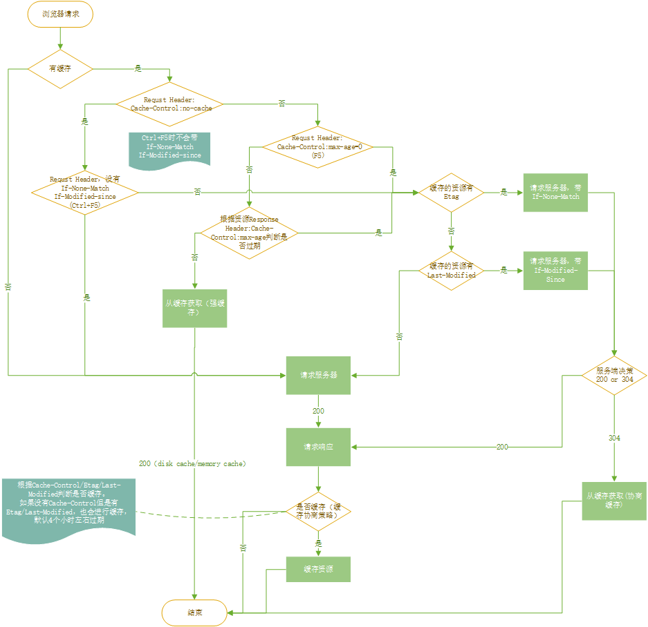

# frontendman.github.io
web development 
* docsify serve . --open



```html
<p>This is a paragraph</p>
<a href="//docsify.js.org/">Docsify</a>
```
```javascript
let s= 100;
console.log(s);
```
```css
.cs{
    margin-left:20px;
}
```