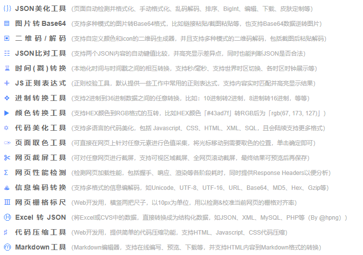
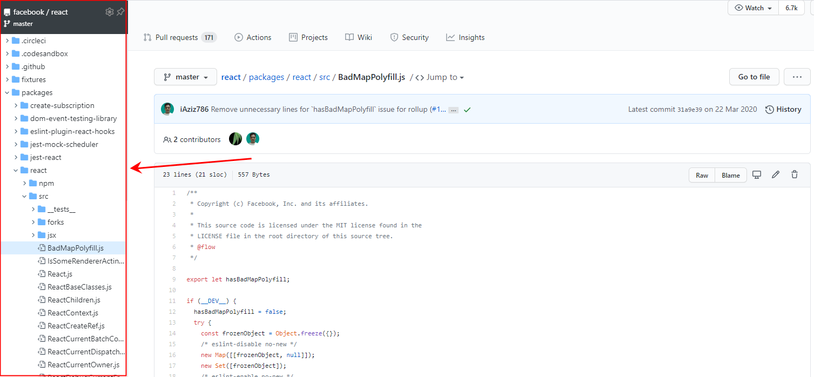
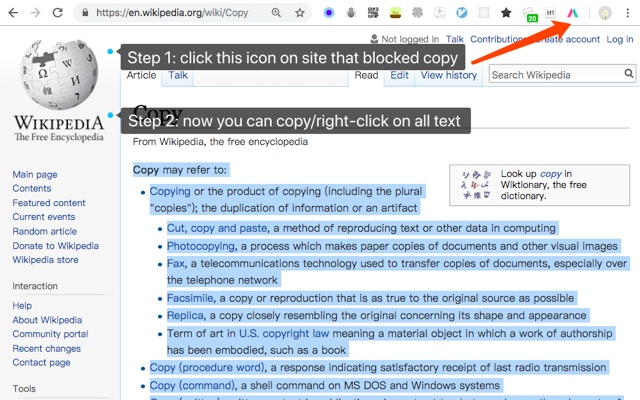
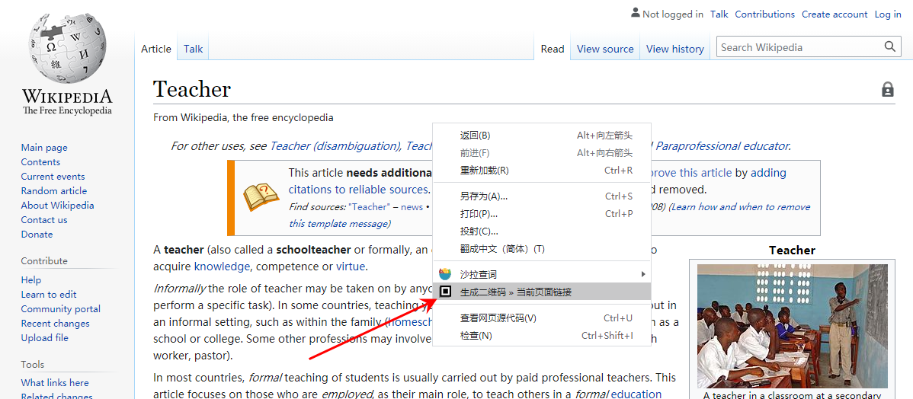
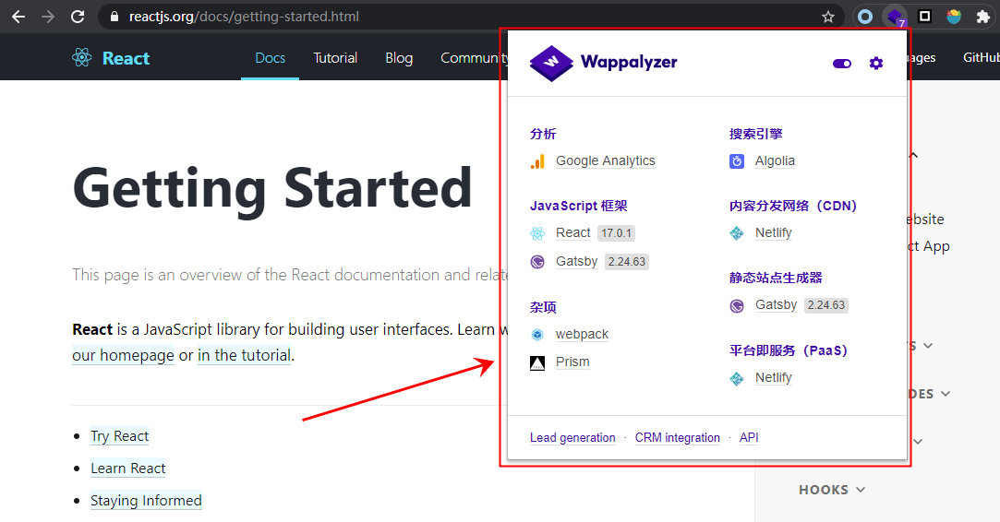
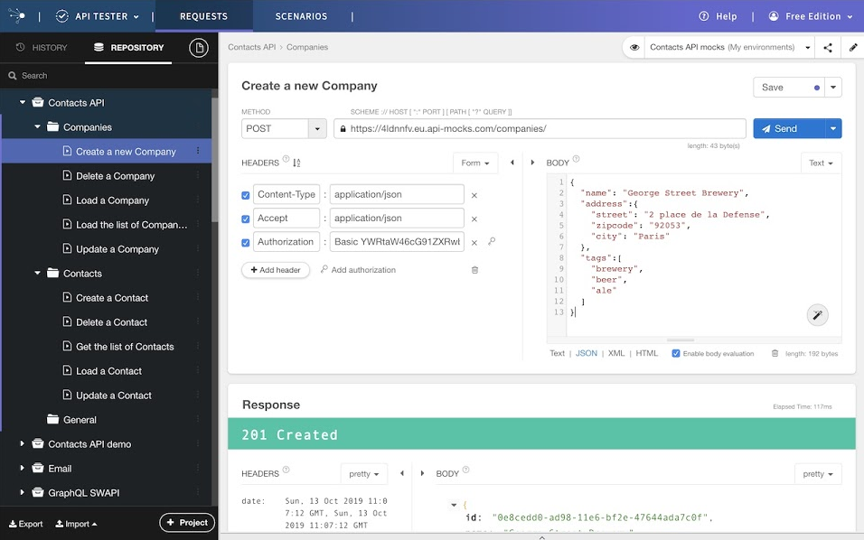
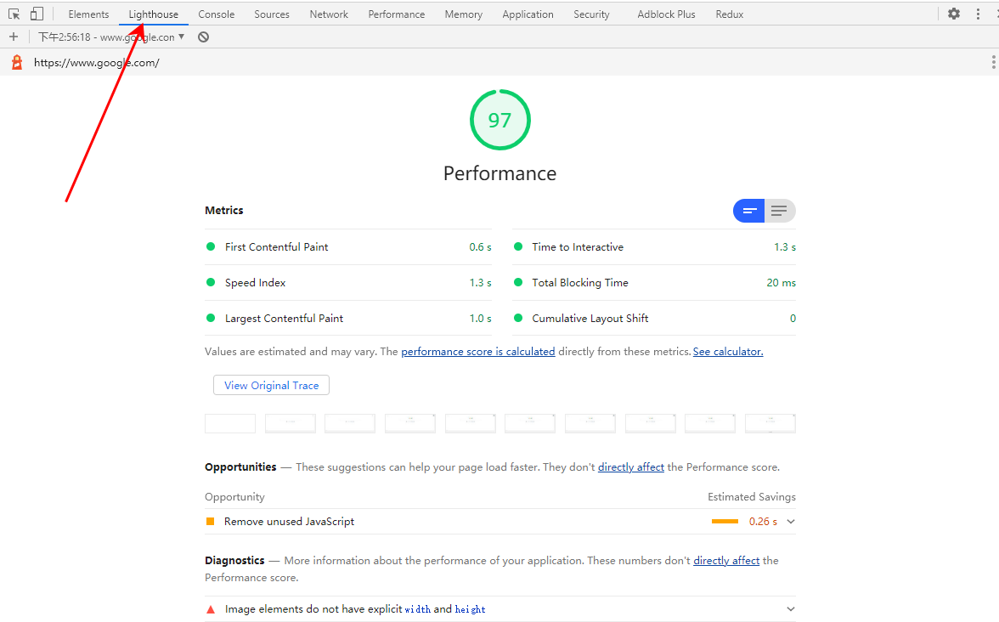

# Chrome插件
推荐一些作为前端开发人员，平时开发中经常使用到的一些实用插件。利用好这些插件，可以有效提高生产效率。
## ADblock Plus：广告拦截器
用于屏蔽烦人的网页广告，让网页专注于内容呈现，还你一个清新的界面，以下是使用该插件前后的对比

| 开启前                         | 开启后                         |
| ------------------------------ | ------------------------------ |
|  |  |

## FeHelper：前端开发小工具集合
内含丰富的小工具，使用之后，就可以告别大部分的在线工具站点

## Octotree：Github项目目录结构
显示Github项目的属性目录结构，通过目录结构对项目有一个全局的了解，同时可以快速定位、查看某个文件。提供更好的源码在线阅读体验。

## 沙拉查词：聚合词典划词翻译
提供划词翻译、网页翻译、网页中英文对照、以及大量词典可选择。辅助进行英文资讯、文档的阅读。

## Simple Allow Copy：任意复制内容
有些站点屏蔽了内容复制能力。通过该插件就可以在绕过这些网站的限制，进行任意内容复制。

##  二维码生成器
通过右键菜单，快速为页面上任一链接、选中内容、当前页面生成二维码

## Wappalyzer：分析网页所使用技术
用于识别当前站点所使用的技术，可以检测所使用的构建工具、Web框架、CDN、托管服务等。不过经过测试，在部分站点上，识别结果不全，但可以作为一个参考。

## Talend API Tester：接口测试
用于模拟请求，测试服务端API。界面简洁，支持请求分组、历史查询、环境变量设置、导入HAR请求等功能。

## Reres：文件映射

## lighthouse：性能检测
对网页进行一系列的测试，并生成页面性能报告，同时给出一些优化建议，帮助开发人员针对性的进行优化

## 其他

Chrome的插件非常丰富，除了以上列举之外，还有很多优秀的插件无法一一列举，如：
* React Developer Tool：React开发调试工具
* Redux Tool：Redux状态管理调试工具
* Image Downloader：图片下载器，显示当前网页所有图片，并支持跟进分辨率进行过滤
* User-Agent Switcher：用于模拟成其他的浏览器或者操作系统
* ...
