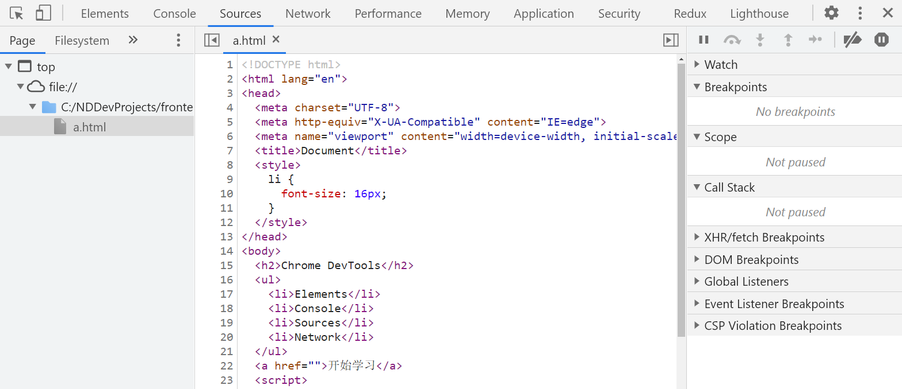

# Chrome DevTools

作为开发人员，平时用的最多的就是 Chrome Devtools 了， 本篇文章将介绍它的常用基础功能和使用技巧。

## 基础功能

首先让我们看下打开 Chrome DevTools 的几种方式

- 右键网页，点击检查
- Command+Option+C (Mac) or Control+Shift+C (Windows, Linux, Chrome OS)
- F12 快捷键

打开后，可以看到 Chrome DevTools 界面


界面顶部有提供看许多面板，其中常用面板作用如下

- Elements: 查看 HTML 元素和 CSS 样式，支持实时修改
- Console: 记录日志信息，且可以作为与 JavaScript 进行交互的命令行 Shell
- Sources: 调试 JavaScript
- Network: 查看网络请求信息
- Performance: 记录并分析在网站的生命周期内所发生的各类事件，以此可以提高网页的运行时间的性能
- Memory: 记录JS CPU执行时间细节、显示JS对象和相关的DOM节点的内存消耗、记录内存的分配细节
- Application: 录网站加载的所有资源信息，包括存储数据（Local Storage、Session Storage、IndexedDB、Web SQL、Cookies）、缓存数据、字体、图片、脚本、样式表等

接下来我们将重点介绍 Elements, Console, Sources, Network 这四个面板。Performance 和 Memory 面板在需要性能调试的时候在使用。 Application 相对简单，可以直接查看相关信息。

### Elements

#### 查看 DOM

查看 DOM 主要有下面两种方式：

1. 右键要查看的 DOM 元素，点击``检查``


2. 点击开发者工具面板左上角的检查按钮（快捷键为 Control+Shift+C），在选择对应的 DOM


在选中 DOM 后，我们可以使用键盘的上下左右浏览 DOM 树。左键收起 DOM 节点，右键为打开 DOM 节点。上下键为移动选中点


#### 编辑 DOM

DOM 的编辑操作可以通过双击对应的 DOM，或者右键点击 DOM。我们可以实时修改 DOM 的标签、属性、内容，甚至还可以打断点监听 DOM 的变化。


#### 查看 CSS

CSS 的查看是在 Elements 面板右侧的 Styles 面板。Styles 面板会展示当前选中的 DOM 节点的样式。


#### 编辑 CSS

CSS 的编辑可以直接在 Styles 面板中进行，在对应的元素选择器下编辑 CSS


### Console

Console 控制台有两个主要用途: 查看日志消息和运行 JavaScript。

在 JavaScript 中输出的日志都可以在控制台中看到

```js
console.log('Loading!')
setTimeout(() => {
  console.log('Hello, Console!')
}, 2000)
```


同时你可以在 Console 控制台中运行 JavaScript。


### Sources

Sources 面板主要用来调试 JavaScript，通常用它来调试 Bug。



面板左边部分为文件导航区，在这里可以看到当前页面加载的所有文件；
中间是代码编辑区域，右边是 JavaScript 调试区域，提供断点的步进、步出、继续等能力。

当需要调试 Bug 时，通常会在代码编辑区域对应的行打上断点，然后在逐步进行排查。


### Network

Network 面板用来检查网络活动，它可以看到当前网页的所有请求。


网络请求列表中，可以看到每条请求的名称，返回状态，请求类型，请求发起者，瀑布流信息。

面板中工具栏还提供了筛选、禁用缓存、限制网速等能力。

## 使用技巧

### 快速打开所有 DOM

Alt + Click 可以快速打开当前 DOM 的所有层级。


### 直观的查看 DOM 层级

当 DOM 层级很多的时候，可以通过这个方式来查看 DOM 层级


### DOM 类名切换

Styles 面板提供了类名快速编辑的能力，相比于直接修改 DOM class属性来说，它提供了更好的调试体验


### 调试伪类

Styles 面板提供了伪类的调试能力


### 改变CSS值的快捷键

可以通过快捷键来调整 CSS 样式的数值

- ``Alt+Up`` + 0.1
- ``Up`` + 1
- ``Shift+Up`` + 10
- ``Ctrl+Up`` + 100


### 控制台
- ``$()``是document.querySelector()的别名
- ``$0`` 返回最近一次选择的元素或 JavaScript 对象
- ``console.table(data)`` 以表格形式打印数据
- ``console.time()`` 和 ``console.timeEnd()`` 跟踪代码执行点之间经过的时间。
- ``getEventListeners(document)`` 获取对象的所有事件

### Copy

当你想到控制台复制数据时可以使用


### keys/values

这个是 Devtools 提供的快速查看一个对象的 keys,values 的 API。


比直接用``Object.keys``, ``Object.values`` 方便些
### 远程调试安卓设备

连接设备后，打开 chrome://inspect/#devices


## 参考资料

- [Chrome DevTools 官方文档](https://developer.chrome.com/docs/devtools/overview/)