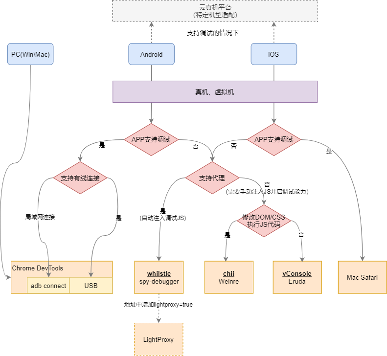
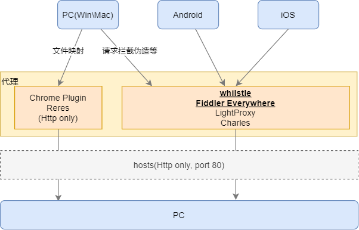

# Debug工具概述

在大部分情况，一个案子有超过一大半的时间是在debug和修复bug。同时前端开发所涉及的环境尤为复杂，需要应对iOS、Android、Mac、Windows这些不同系统中不同版本的浏览器环境。如何搭建一个好用的debug环境，快速定位问题、排查故障，对开发效率影响尤为重要。出于此催生了`Sourcemap` 、`Remote debugging protocol`等技术以及`Chrome Devtool`、`Wenire`、`spy-debugger`等调试工具。对于前端人员来说，掌握这些工具和技巧，往往能够事半功倍。

本篇文章主要介绍如何选择调试工具，至于工具的详细使用方案，会在后续的文章中一一介绍。

## PC端调试工具
* `Chrome DevTools`：功能强大，基本涵盖所有调试场景。内部集成了包含`Console`、`Network`、`Performance`、`Element`、`Source`、`Application`等面板，提供了DOM/CSS查看修改、JS调试、性能分析、网络请求查看、网络带宽模拟、CPU性能模拟、设备模拟等非常丰富的功能

## 移动端调试工具

对于移动设备情况相对复杂，移动端上没有内置的调试工具，无法直观查看网页DOM、CSS、网络请求，也不能进行JS断点调试。所以这就需要借助一些外置的调试工具。虽然现在官方都提供了一些

#### 虚拟机

在缺乏真机的情况下，可使用虚拟机进行模拟

* `Android`
  * `Android Stutio AVD Manager`
* `iOS`
  * `iOS simulator`

#### 云真机平台

Android虚拟机通常只能支持谷歌官方特定系统的模拟。而通过云真机平台，还可以实现特定机型模拟。一些平台在模拟器上还集成了远程开发调试工具，方便开发人员完成特定机型的适配。

* [`岩鼠平台`](https://zhuanlan.zhihu.com/p/81229988)：支持远程调试

#### 模拟调试面板

通过在网页中引入一段JS代码，来注入一个模拟调试面板，用于查看DOM/CSS、日志、网络请求、本地存储，支持执行JS代码。但是不支持动态修改DOM/CSS，在面板上进行JS代码录入体验也不好，整体功能较弱。

* [`vConsole`](https://github.com/Tencent/vConsole)
* [`Edura`](https://github.com/liriliri/eruda)

#### 远程调试工具

以下两种是官方提供的远程调试工具，也是目前最常用的

* [`Chrome DevTools`](https://developer.chrome.com/docs/devtools/javascript/)(Android)：可以通过有线(`USB`)和局域网无线(`adb connect`)的方式接入DevTools，是移动端调试功能支持最为完整的工具。大部分PC端能支持的功能，在远程模式下也都支持。
* `Mac safari Web Inspector`(iOS)：能力基本同Chrome DevTools

大部分情况下以上两种调试工具即可满足使用，但是APP在正式发布之后一般就会禁用Webview的调试功能，导致无法连上以上这些调试工具，这个时候就需要引入以下的工具进行辅助

这些工具需要在本地开启一个服务，然后在调试的网页上注入一段JS代码，指向这个服务。整个调试面板非常类似Chrome DevTools，提供了DOM/CSS查看修改、JS执行、日志查看、本地存储查看、有限的网络监控（仅xhr）

* [`Weinre`](https://people.apache.org/~pmuellr/weinre/docs/latest/Home.html)：基于`Web Inspector`
* [`Chii`](https://github.com/liriliri/chii/)：集成最新的[`chrome devtools frontend`](https://github.com/ChromeDevTools/devtools-frontend)

上面的工具需要在网页上注入一段JS代码，对于已经上线的站点，这一点很难做到。为解决这个痛点，社区里已经有人开发了集成weinre或chii的代理工具。在代理时动态注入调试的JS代码，进一步降低调试成本。

* [`Whistle`](http://wproxy.org/whistle/install.html)：通过npm安装，内部集成了`Weinre`，同时支持安装插件来支持`Chii`、`vConsole`、`Edura`、`Node.js管理请求`
* [`spy-debugger`](https://github.com/wuchangming/spy-debugger/blob/master/README_EN.md)：内部集成了Weinre
* [`LightProxy`](https://lightproxy.org/doc/getting-started)：基于Whistle的Electron客户端，支持通过Node.js进行请求拦截处理，集成`chrome devtools frontend`

除此之外还有**收费**的`GhostLab`，内置`Chrome devtolls frontend`+`Browersync`，不过需要通过它生成一个新的代理地址，在终端上打开生成的代理地址进行远程调试

## 代理工具

在一些特定的调试场景，需要对请求做一些特殊处理，这就需要引入一些代理工具，例如
* 映射线上JS、CSS文件到本地，方便进行问题的排查和修复的验证
* 伪造请求响应，返回特殊数据，用于绕过特定流程或者进行一些边界测试
* ...

#### 远程代理工具

代理工具一般包含的能力
* 请求监控
* 请求模拟
* 请求转发
* 请求拦截
* 响应伪造

目前比较流行的几个代理工具
* [`Whistle`](http://wproxy.org/whistle/install.html)：所有的内容都基于一个文本编辑器进行配置，有一定的学习成本
* [`LightProxy`](https://lightproxy.org/doc/getting-started)：同上
* [`Fiddler Everywhere`](https://docs.telerik.com/fiddler-everywhere/get-started/installation-procedure)：请求代理调试工具+一部分的Postman的能力，交互上较为友好
* [`Charles`](https://www.charlesproxy.com/)：同上

#### chrome代理插件

如果只是在PC端进行JS、CSS文件映射的需求，可以使用Chrome文件映射插件，比较轻量

* `reres`(*仅支持http协议*)

#### hosts DNS重写

通过修改PC的`hosts`文件，来进行域名转发

!> 仅支持http协议，不支持指定端口号

## 总结（如何选择）

#### 调试工具

#### 代理工具

?> <strong><u>下划线+粗体</u></strong>标记的工具为同类型优先推荐使用

## 参考资料

* [前端调试工具概述](http://jartto.wang/2018/11/01/mobile-debug/)
* [H5 移动调试全攻略](https://www.yuque.com/lingxiteam/wg3u8q/pw7ha3)

## 其它资料
* 抓包工具
  * wireshark
* 优秀站点
  * codepen
  * codesanbox
  * CSS
    * [CSS3动画编辑器](http://cssanimate.com/)
    * [Can i use](https://caniuse.com/)
    * [Css Triggers 重绘重排样式查看](https://csstriggers.com/)
  * [regexper 正则规则查看](https://regexper.com/#df*ddf(df))
* 画图工具
  * 客户端
    * Enterprise Architect ：UML绘图
    * visio：流程图、**泳道图**、架构图等自由度较高的图
  * 在线
    * drawio：自由度较高的图
    * processon（多人协作）：自由度较高的图
    * wps（多人协作）：**思维导图**+processon

