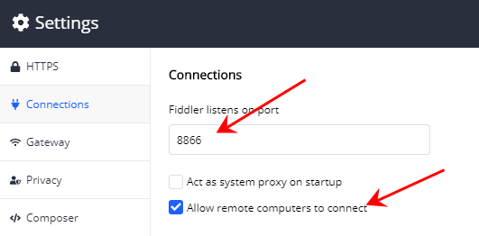

# Fiddler Everywhere

## 下载

* 方式一：通过[官网](https://www.telerik.com/download/fiddler/fiddler-everywhere-windows)下载最新版本，但是比较慢
* 方式二（推荐）：通过[国内软件下载站点](http://www.itmop.com/downinfo/434956.html)下载，速度较快，下载后根据更新提示，更新为最新版本即可。

## 配置

> 配置后，即可实现本地和远程的HTTP/HTTPS代理

**Step1.开启HTTPS监控，安装本地HTTPS证书**

**Step2.设置端口号，开启远程监控**

**Step3.手机安装HTTPS证书**

在手机浏览器上打开代理地址(`http://{代理ip}:{代理端口}`)，下载并安装证书

?> 这些配置完成后，还要设置手机Wifi或PC端浏览器代理（如何设置代理不在这里赘述）。

## 开始监控

配置完成后，开启监控`Live Traffic`，验证下代理是否成功。通过监控面板可以查看请求列表、过滤请求、查看请求和响应信息，还可以将请求进行保存分享等

## 模拟响应

模拟服务器响应和各种真实场景，方便进行的测试

开启`Auto Responder`，并添加规则

### Match说明(常用)

支持接受字符串字面量、正则表达式和一组特殊的匹配规则

| 规则                            | 例子                            | 说明                                          |
| ------------------------------- | ------------------------------- | --------------------------------------------- |
| 字符串-完全匹配（不区分大小写） | http://baidu.com/index.js       | 请求地址和Match内容必须一模一样，大小写不敏感 |
| EXACT:（区分大小写）            | EXACT:http://baidu.com/index.js | 请求地址和Match内容必须一模一样，大小写敏感   |
| regex:                          | regex:http://baidu.com/\d+.js   | 通过正则规则匹配请求地址                      |
| NOT:                            | NOT:baidu.com                   | 不匹配地址中包含baidu.com的请求               |

### Action说明(常用)

| Action                           | 例子                               | 说明                                                     |
| -------------------------------- | ---------------------------------- | -------------------------------------------------------- |
| xxx.bat                          | 200_SimpleHTML.dat                 | 返回内置的http状态码和内容                               |
| filename                         | D:\Code\index.js                   | 返回本地文件内容作为响应                                 |
| http://targetURL                 | http://192.168.x.x/index.js        | 返回URL地址返回的内容作为响应                            |
| *redir:http://targetURL          | *redir:http://192.168.x.x/index.js | 返回到目标URL的重定向内容。同时会发送正确的cookie等信息  |
| *delay:###                       | *delay:1000                        | 延迟指定毫秒后，发送请求到服务器                         |
| *CORSPreflightAllow              |                                    | 将一个请求标记为允许跨域                                 |
| Choose saved response file...    |                                    | 弹出文件选择窗口，选择一个文件作为响应内容（同filename） |
| Return manually crafted response |                                    | 伪造一个完整的响应，包含Header和Body                     |

**伪造完整响应`Return manually crafted response`**

## 模拟请求

通过两种方式创建模拟请求，创建后即可对请求进行编辑、执行和保存，整体功能类似Postman
* 创建空白模拟请求
* 基于监控列表的请求，创建模拟请求

## 参考资料

* [官网 Get Started](https://docs.telerik.com/fiddler-everywhere/get-started/installation-procedure)