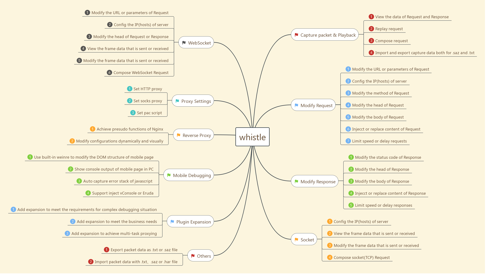

# whistle

## 前言

在移动端开发中，需要面对 iOS、Android、微信等不同环境下的浏览器，大多数情况下，我们可以通过 chrome://inspect 进行调试。

但是对于无法使用 inspect 进行调试的情况，缺少了 Chrome devtools 的帮助，大多数人排查问题、调试起来变回变得无所适从。

这个时候，我们可以使用诸如 Vconsole、Eruda、whistle 等工具，本篇将为您介绍`whistle`的使用方式以及相比其他工具，它所具有的优势。

## 概览

whistle 同时具备以下能力：

- 查看修改 HTTP、HTTPS、HTTP2、WebSocket、TCP 请求响应数据、
- 设置 hosts
- 支持多种匹配模式的
- 集成常用的 web 调试工具，如 weinre
- 支持用 node 编写扩展插件，一般可用于处理客户端的请求、规则服务、状态服务，处理服务端的响应、响应规则服务，响应状态服务等。

whistle 集成了 fiddler、weinre 大部分功能于一体，使用起来更加的便捷

以下是 whistle 的一个概览，它简要的标明了 whistle 具有的各个功能模块



## 安装启动

- 安装 Node(>=0.10.0)
- 安装 whistle
  sudo npm i -g whistle
- whistle 相关操作
  启动：w2 start
  重启：w2 restart
  停止：w2 stop
  调试：w2 run
  帮助菜单：w2 help
  更新： sudo npm i -g whistle && w2 restart

- 配置代理

  - macOS

  选择当前网络，Advanced
  

  设置 proxy
  
  这边注意。部分代理工具会开启 Automatic Proxy Configuration，需要关闭此选项
  设置 http、https 代理服务器以及端口
  whistle 默认启动端口为 8899，可通过 w2 start -p `port`

  将证书设置为可信

  

  - 手机代理

  选择当前网络，配置代理

  

  安装证书
  访问 whistle 后台，选中 HTTPS
  

  

- 访问配置页面

  - 方式一：http://local.whistlejs.com:8899

    whistle 官网没加端口号,这边可通过添加 Rules 进行域名匹配，将端口号去掉
    如：local.whistlejs.com 127.0.0.1:8899

  - 方式二：http://127.0.0.1:8899

    

## 配置方式

### 常用规则配置

在 whistle 中，可以通过 Rules 配置规则分组，规则分组可以用于

- 设置 hosts
  如

      local.whistlejs.com 127.0.0.1:8899
      www.baidu.com 127.0.0.1:8899

- 本地替换
  可以把响应替换成本地文件内容，在平时开发中可能会用到这个功能。

      www.test.com /Users/rex/Downloads/main.xlsx

  上面的例子，将 www.test.com 指向了本地文件 main.xlsx

- 请求转发

      www.baidu.com www.zhihu.com

  上面的例子，将 www.baidu.com 域名下的请求，重定向到了www.zhihu.com域名下

- 调试远程页面

      www.test.com weinre://test

  如上，为 www.test.com 注入了 weinre 调试所需的 js 脚本。然后通过后台上的 weinre 面板访问 weinre 的调试界面

### 配置方式

- 默认方式`pattern operatorURI`
  默认是将匹配模式写在左边，操作 uri 写在右边

      local.whistlejs.com 127.0.0.1:8899

- 传统方式`operatorURI pattern`

      127.0.0.1 localhost

- 组合方式
  传统 hosts 的配置对多个域名对于同一个 ip 的情况可以采用这种方式：

      127.0.0.1 www.test1.com www.test2.com www.testN.com

- 更复杂的配置

  - 正则匹配

        /test/ www.zhihu.com

  - 精确匹配

    `包含请求协议`:
    `${protocol}://{domain} {forwardDomain}`
    如

        http://www.aaa.com hupu.com

    `不包含请求协议`
    `${domain} {forwardDomain}`

  - 响应 json 数据

    在 test.txt 中存储

        {
          "key1": value1,
          "key2": value2,
          "keyN": valueN
        }

    通过配置

         www.test.com/test.html file://\/Users/rex/Downloads/test.txt

    可以得到 test.txt 中的 json 数据

### 常用配置

- 绑定转发

```
## disable,对某些域名不拦截
## 一般放到 Default 分组
/wx.qq.com/ disable://intercept
## filter,在Network不会出现某些域名的请求
/qq.com/ filter://hide

## socks
## 一般放到 Default 分组
/facebook/ socks://127.0.0.1:1080
/vk.com/ socks://127.0.0.1:1080
/google/ socks://127.0.0.1:1080

## 一般场景是调试内嵌APP页面，APP内有一个入口链接a，而调试的目标页面是b
## 通过以下一行配置，页面a会自动换成页面b
www.test.com/a.html www.test.com/b.html

## 绑定
## a.b.c.d 是某个环境的ip地址
## 有时通过多个域名的方式来部署多套开发环境
## 通过以下两行配置可以屏蔽开发环境域名与线上不一致的情况
www.test.com mwww.test.com
mwww.test.com a.b.c.d

```

- req

```
## ua
www.test.com ua://{wp_ua}
#www.test.com ua://{ali_ua}

## referrer
www.test.com referer://https://vk.com/
## referrer null
#www.test.com referer://

## reqHeaders，修改请求头
## ua、referer协议都可以通过reqHeaders来完成
www.test.com reqHeaders://{req-headers}
```

- res

```
## file，本地调试是其典型的使用场景
www.test.com/sw.js file:///path/to/your/local/sw.js
## xfile
#www.test.com/sw.js xfile:///path/to/your/local/sw.js

## tpl，常用于mock jsonp请求
aliexpress.com/query.jsonp tpl://{res-jsonp}
## xtpl，同tpl，本地不存在时走线上
aliexpress.com/query.jsonp xtpl://{res-jsonp}

## resHeaders，修改响应头
ae01.alicdn.com resHeaders://{res-cors}

## html，往html文档(</body>之前)追加html标签(script,style or normal html tag)
www.test.com html://{html-test}

## js，往js响应追加脚本，如果响应是html文档，则自动用`<script></script>`包装后插入
www.test.com/sw.js js://{js-test}

## css，往css响应追加样式，如果响应是html文档，则自动用`<style></style>`包装后插入
## `/`可以起到仅对首页追加的效果
www.test.com/ css://{css-test}

## resReplace，替换响应的某些字符串
## 一般可用来快速验证某些功能
www.test.com resReplace://{res-replace}
```

- debug

```
www.test.com weinre://debug
www.test.com log://{log-test}
```

## 插件开发

为了满足一些特定业务场景的需要，whistle 提供了插件扩展能力，通过插件可以新增 whistle 的协议实现更复杂的操作、也可以用来存储或监控指定请求、集成业务本地开发调试环境等等，基本上可以做任何你想做的事情，且开发、发布及安装 whistle 插件也都很简单。

- 插件原理

whistle 的插件是一个独立运行的进程，并通过暴露一些 http server 的方式实现与 whistle 的交互，whistle 会在特定阶段请求特定的 server，如图：


每个 whistle 插件就是一个普通的 npm 包，whistle 为插件提供了强大的扩展能力，不仅可以操作 whistle 所有规则，且具备 node 的所有能力，可用来做以下事情：

    提供 UI 界面
    作为请求 Server（直接响应或转发并修改请求响应）
    统计请求信息（查看上报/打点数据等）
    设置规则（动态，静态，全局及私有规则）
    获取抓包数据
    编解码请求响应数据流
    扩展 Network 右键菜单
    保存并同步 Rules & Values 数据

- 官方插件

  如何编写插件：[helloworld](https://github.com/whistle-plugins/whistle.helloworld)

  官方脚手架，，如何编写 whistle 插件：[examples](https://github.com/whistle-plugins/examples)

  Vconsole、Eruda：[whistle.inspect](https://github.com/whistle-plugins/whistle.inspect)

  数据 Mock：[whistle.vase](https://github.com/whistle-plugins/whistle.vase)

## 常用功能

### Network

查看请求响应的请求列表以及详细信息


### Compose

用来重发请求、构造请求，可以自定义请求的 url、请求方法、请求头、请求内容。


### Rules

用于创建规则分组


### Values

配置 key-value 的数据，在 Rules 里面配置可以通过{key}获取，
如 m.aliexpress.com resHeaders://{test}

将会在响应头添加 test:1


### Weinre

集成[weinre](http://people.apache.org/~pmuellr/weinre/docs/latest/)的功能，用户只需通过简单配置 `url weinre://{weinre分组}`即可使用

### HTTPS

下载根证书，开启捕获 HTTPS 请求

## 参考

[whistle](http://wproxy.org/whistle/)
