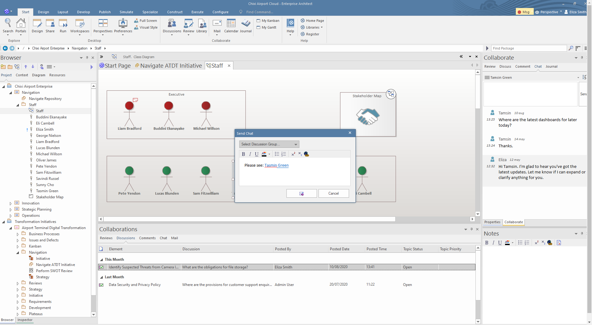
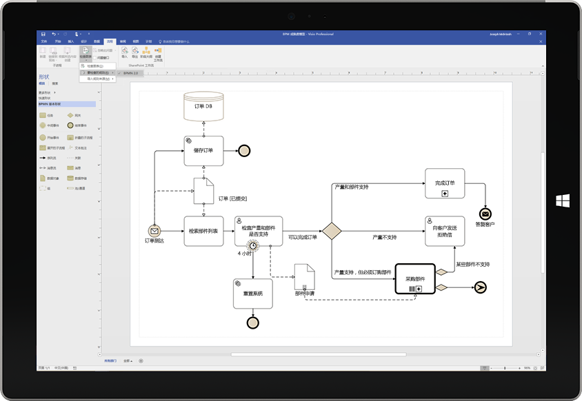
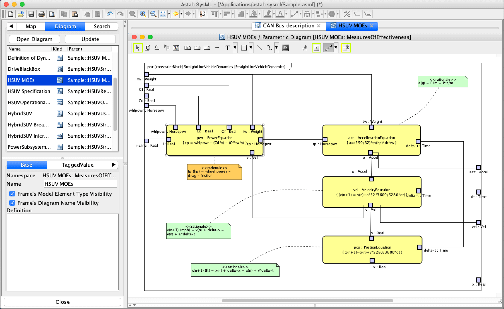
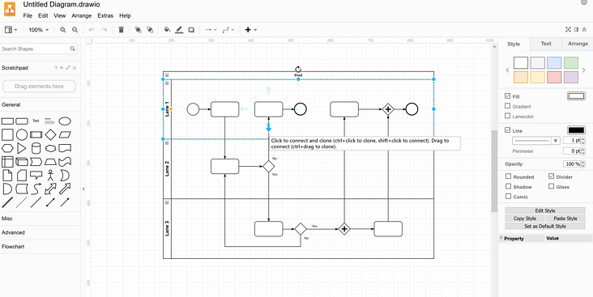
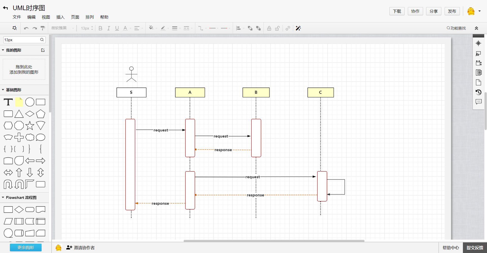
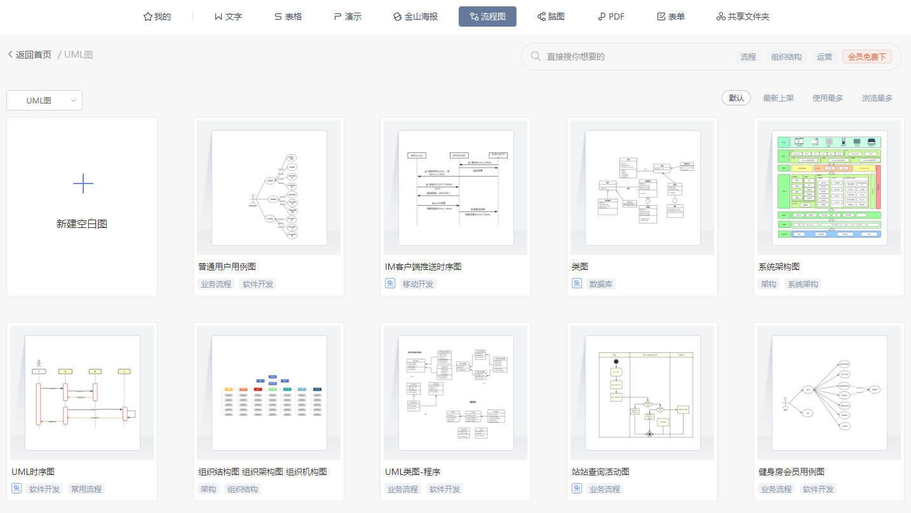

# 画图工具

## 客户端

### Enterprise Architect ：UML绘图

作为一款专业的UML软件开发与建模工具, 其以超凡的建模效率与质量, 无比友好的和简洁的用户界面令人耳目一新

### Visio：流程图、**泳道图**、架构图等自由度较高的图

Microsoft Visio是一款流程图软件工具和画图软件。

### Astah: 跨平台画图工具

Astah Professional(UML建模工具)是一款功能非常强大的UML建模工具；它是100% 纯 Java 应用程序，功能的强大表现在可以跨平台的在各种的主流操作系统里面使用

## 在线

### [Drawio](https://www.draw.io/): 自由度较高的图

支持绘制流程图、架构图、网络拓扑图、E-R图、PPT商务图表等，支持在线绘制和桌面版

### Processon:（多人协作）自由度较高的图

ProcessOn 是一个在线作图工具的聚合平台，它可以在线画流程图、思维导图、UI原型图、UML、网络拓扑图、组织结构图等等。

### WPS: 多人协作

WPS作为一款办公软件，它其实也支持画图

