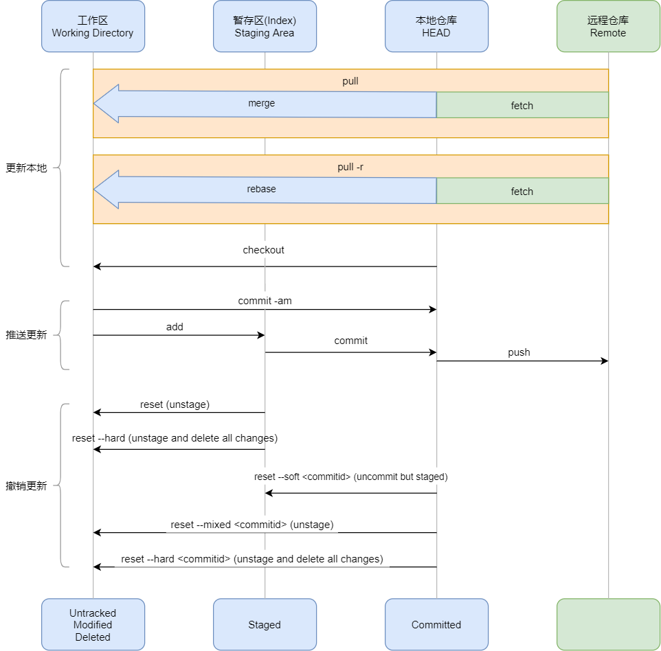

# Git常用指令
通过上一篇文章`Git基本原理`，对Git的内部机制有了一个初步了解。接下来通过一篇文章来了解开发过程中经常使用到的基础指令。先看下整体的工作流程



## 仓库管理

**创建新仓库**

* `git init`：创建新的文件夹本地仓库，打开并执行该命令来创建新的仓库

**克隆仓库**

* `git clone <url> `：检出仓库默认分支
* `git clone <url> <folderName>`：检出参考默认分支到自定义文件夹下

**查看仓库**
* `git remote -v`：查看当前仓库地址


## 分支管理

**创建分支**

* `git branch <name>`：仅创建分支
* `git checkout -b <name>`：创建并切换到分支
* `git push --u origin <name>`：推送新分支到远程仓库

**查看分支**

* `git branch`：查看本地分支
* `git branch -a` ：查看所有分支，包含远程分支

**切换分支**
* `git checkout <name>`：切换到指定分支

切换分支前，当前分支有改动，但是又不想提交，这个时候可以运行以下命令暂存
```bash
//Step1: 暂存信息
git stash save -u '备注信息'

//Step2：切换分支
git checkout <name>

```

**删除分支**
* `git branch -d <branchname>`：删除本地分支
* `git push origin --delete <branchname>`：删除远程分支

**分支更新**
* `git pull`： 获取并合并远端的改动，等效于`git fetch`+`git merge`
* `git pull -r`：通过变基的方式合并远端的改动，等效于`git fetch`+`git rebase`（推荐使用这种方式）

分支更新参考流程

```bash
//Step1: 暂存未提交的改动内容（有未提交的改动时，无法执行 git pull 指令）
git stash

//Step2: 获取最新内容并合并
git pull -r

//Step3: 恢复暂存的内容
git stash pop
```

**合并分支**
* `git merge <targetBranch>`：合并指定分支
* `git pull origin <targetBranch>`：获取目标分支最新代码，并和当前分支合并，等效于`git fetch`+`git merge`
* `git merge --abort`：终止本次合并，并回退到合并前的状态

采用git merge方式合并大致流程

```bash
//Step1：获取最新目标分支内容
git checkout <targetBranch>
git pull

//Step2：切回原分支
git checkout <originBranch>

//Step3：合并目标分支
git merge <targetBranch>

//Step4：处理本地冲突

//Step5：提交合并结果到云端仓库
git add .
git commit 
git push
```

## 推送改动

**检查状态**

* `git status`：确认是否有文件改动（`modified、untracked、deleted`）需要提交

**添加改动**

开始跟踪改动，并把已跟踪的内容放到暂存区。
* `git add <filename>`：暂存某个文件
* `git add .`：暂存所有文件

**提交改动**


* `git commit -m '备注信息'`：把内容提交到本地仓库

如果你想修改上一次的提交（合并新的改动或者修改备注信息），可以使用以下命令，最终你只会有一个提交，第二次提交将合并，并代替第一次提交。
* `git commit --amend`：将这次提交内容和上一次提交内容合并，同时使用上一次提交的备注信息
* `git commit --amend -m '新的备注信息'`：将这次提交内容和上一次提交内容合并，同时使用新的备注信息

**推送改动**

* `git push`：将提交推送到服务端仓库

## 撤销改动

**git reset**
这个部分的指令可直接参考上图中的工作流程
* `git reset`：取消`add`操作
* `git reset --hard`：重置未`commit`的所有修改
* `git reset --soft <commitid>`：重置到某个`commitid`，将该`commitid`的改动提交到暂存区。重置时和本地未`commit`的改动进行合并。
* `git reset --mixed <commitid>`：重置到某个`commitid`，重置后该`commitid`的改动还未提交到暂存区。重置时和本地未`commit`的改动进行合并。
* `git reset --hard <commitid>`：重置到某个`commitid`，重置后该`commitid`的改动还未提交到暂存区。重置时不保留本地改动，会删除当前分支的未`commit`的所有改动
* `git checkout <filename>`：重置某个文件内容

## 查看日志

**查看提交日志**

* `git log`：查看本地所有提交记录
* `git log -p -2` ：查看最近几次的提交记录

**查看所有操作日志**

* `git reflog`


## tag管理

**查看tag**
* `git tag`: 查看tag列表
* `git show <tagname>`：查看tag详情

**创建tag**
* `git tag -a [tagname> -m [tag备注>`：创建本地tag
* `git push origin <tagname>`：推送tag到远端仓库

**删除tag**
* `git tag -d [tagname]`：删除本地tag
* `git push origin :refs/tags/[tagname]`：删除远程仓库tag。需要注意的是，删除远程tag时，本地的并不会一起删除

**检出tag**
* `git checkout [tagname]`：仅检出tag的内容
* `git checkout -b [branchname] [tagname]`：检车该tag内容，并创建新的分支。一般我们需要修复某个旧版本的bug时，都是通过这种方式来处理。


## 参考资料
* [史上最全Git命令学习：从基础出发，上手原来如此So easy！](https://zhuanlan.zhihu.com/p/180447373)
* [Git详解1-Git分区，配置与日志](https://juejin.cn/post/6933863550683185160#heading-25)