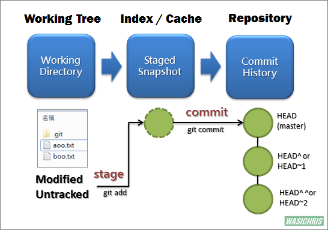
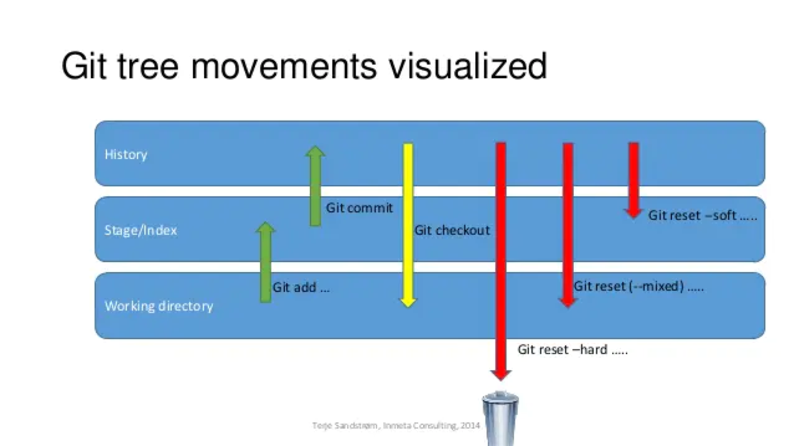

# reset & revert

## 问题

在利用 git 实现多人合作程序开发的过程中，我们有时会出现错误提交的情况，此时我们希望能撤销提交操作，让程序回到提交前的样子，这个时候，我们可以使用：reset、revert。

## Git 的基本流程

`Working Tree` 当前的工作区域

`Index/Stage` 暂存区域，和 git stash 命令暂存的地方不一样。使用 git add xx，就可以将 xx 添加近 Stage 里面

`Repository` 提交的历史，即使用 git commit 提交后的结果

## reset

### 背景知识

git reset 的 3 种工作模式

### 解决方案

- `要放弃目前本地的所有改变時`

使用 git reset --hard：重置 stage 区和工作目录:

reset --hard 会在重置 HEAD 和 branch 的同时，重置 stage 区和工作目录里的内容。当你在 reset 后面加了 --hard 参数时，你的 stage 区和工作目录里的内容会被完全重置为和 HEAD 的新位置相同的内容。即没有 commit 的修改会被全部重置。

- `想合并[当前节点][reset目标节点]之间不具太大意义的 commit 记录`

reset --soft：保留工作目录，并把重置 HEAD 所带来的新的差异放进暂存区

reset --soft 会在重置 HEAD 和 branch 时，保留工作目录和暂存区中的内容，并把重置 HEAD 所带来的新的差异放进暂存区。

- `commit提交某些错误代码，或者没有必要的文件也被commit上去，不想再修改错误再commit`

git reset 如果不加参数，那么默认使用 --mixed 参数。

它的行为是：保留工作目录，并且清空暂存区。也就是说，工作目录的修改、暂存区的内容以及由 reset 所导致的新的文件差异，都会被放进工作目录。

简而言之，就是「把所有差异都混合（mixed）放在工作目录中」。

## revert

### 需要撤销某次操作

使用 git revert `commitId`

git revert 是用一次新的 commit 来回滚之前的 commit，此次提交之前的 commit 都会被保留；

与 git revert 不同，git reset 是回到某次提交，提交及之前的 commit 都会被保留，但是此 commit id 之后的修改都会被删除

## 其他

git reset 命令主要用来根据你传递给动作的参数来执行撤销操作。 它可以移动 HEAD 指针并且可选的改变
index 或者暂存区，如果你使用 --hard 参数的话你甚至可以改变工作区。

git revert 命令本质上就是一个逆向的 git cherry-pick 操作。 它将你提交中的变更的以完全相反的方式
的应用到一个新创建的提交中，本质上就是撤销或者倒转。 我们在 还原提交 一节中使用此命令来撤销一个合并提交。
