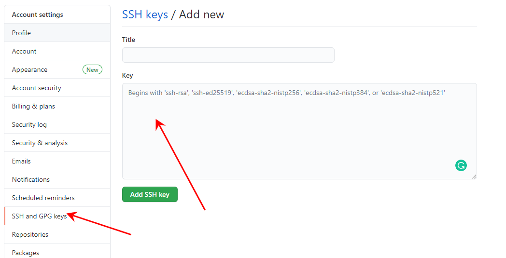

# Git基本设置

## Git config

Git config有三个不同的作用域，优先级`仓库级别`>`用户级别`>`系统级别`。大部分情况下直接使用`用户级别`就可以。

* `git config --system`：系统级别，配置内容存储在git的安装目录`/mingw64/etc/gitconfig`文件中
* `git config --global`：用户级别，配置内容存储在用户目录`.gitconfig`文件中
* `git config --local`：仓库级别，配置内容存储在当前仓库`.git/config`文件中

可以使用指令或者文本编辑器来修改这些配置文件。

其中最常用到的几个配置指令：
* 修改配置：`git config [--global|--system|--local] <参数名> <值>`
* 移除配置：`git config [--global|--system|--local] --unset <参数名> `
* 查看配置：`git config [--global|--system|--local] -l `
* 查看所有配置：`git config -l `


**Step1：配置用户信息**

`user.name`和`user.email`用于标识提交人信息，最终会被添加到每一条提交信息中

```bash
git config --global user.name 姓名
git config --global user.email 邮箱
```

**Step2：开启大小写铭感**

```bash
git config --global core.ignorecase false
```

**Step3：历史记录显示在一行内**
```
git config --global format.pretty oneline
```

**Step4：定义别名**

通过定义别名来简化一些操作。因为别名较多，直接修改`.gitconfig`文件更为方便。这边仅列出一些我自己常用的别名，大家可以按自己的习惯来调整

```bash
[alias]
	# 暂存
	ac = !sh -c 'git add . && git commit -m $1' -

	# 暂存、提交、推送
	acp = !sh -c 'git add . && git commit -m $1 && git push' -

	# 更新代码
	plr = !sh -c 'git stash && git pull --rebase && git stash pop' -

	# 暂存、提交、推送gerrit 
	acpg = !sh -c 'git add . && git commit -m $2 && git push origin HEAD:refs/for/$1' -

	# 暂存、提交、推送git（绕过gerrit）
	acpgg = !sh -c 'git add . && git commit -m $2 && git push origin HEAD:refs/heads/$1' -

	# 推送gerrit
	pg = !sh -c 'git push origin HEAD:refs/for/$1' -
	# 推送git（绕过gerrit）
	pgg = !sh -c 'git push origin HEAD:refs/heads/$1' -

```
使用示例
```bash
git ac '备注信息'
git acp '备注信息'
git plr 
git acpg master '备注信息' 
git acpgg master '备注信息' 
git pg master
git pgg master 
```

## 配置SSH
目前git服务器一般都支持https和ssh两种协议。https协议默认每次提交变更到服务端时，都需要输入用户名和密码，虽然可以通过在地址中加入用户名和密码的方式来规避这个问题。但是每个地址都需要设置，相对繁琐。同时密码以明文的形式存储在电脑中也会带来一定风险。

一劳有逸的方法就是使用SSH协议，通过配置Git服务器的SSH公钥，来简化整个验证过程

**Step1 首先打开`git bash`，切换到`.ssh`目录**
```bash
cd ~/.ssh
```
**Step2 生成一对公钥和密钥**

执行以下命令（调整成自己的邮箱和文件名），并一路回车

```bash
ssh-keygen -t rsa -C 'demo@xx.com' -f github_rsa 
```

最终会生成两个文件
* `github_rsa`：密钥
* `github_rsa.pub`：公钥

**Step3 拷贝公钥**

```bash
cat github_rsa.pub
```

**Step4 配置Git服务器SSH Key**

这边以`github`为例，将拷贝的公钥粘贴到下图的配置中并保存，这样就完成了SSH的配置了。



## .gitignore

配置哪些文件不被git跟踪，以下是前端项目常用的配置，新建`.gitignore`文件，放在`package.json`同级目录下

```
node_modules/
dist/
coverage/
.idea/
.vscode/

npm-debug.log*
yarn-debug.log*
yarn-error.log*

.tmp
*.bak
*.swo
*.swp
*.diff
*.log
*.patch
```
## 参考资料

* [Git详解1-Git分区，配置与日志](https://juejin.cn/post/6933863550683185160#heading-25)