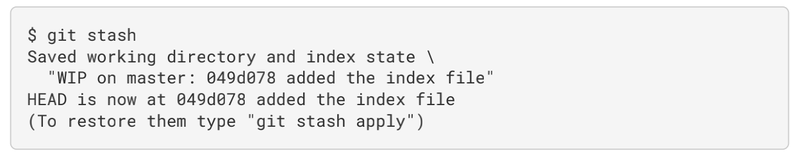
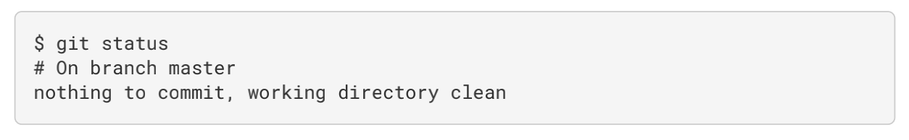
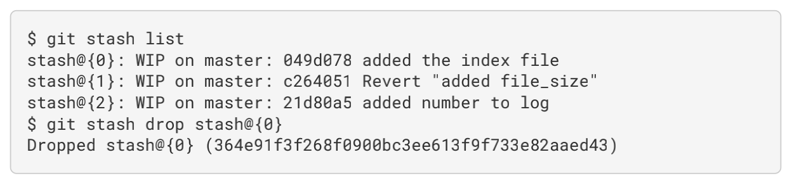

# stash

## 背景

有时，当你在项目的一部分上已经工作一段时间后，所有东西都进入了混乱的状态， 而这时你想要切换到另一 个分支做一点别的事情。 问题是，你不想仅仅因为过会儿回到这一点而为做了一半的工作创建一次提交。 针对这个问题的答案是 git stash 命令。
贮藏（stash）会处理工作目录的脏的状态——即跟踪文件的修改与暂存的改动——然后将未完成的修改保存到一
个栈上， 而你可以在任何时候重新应用这些改动（甚至在不同的分支上）。

## 使用场景

### 贮藏工作

有时，当你在项目的一部分上已经工作一段时间后，所有东西都进入了混乱的状态， 而这时你想要切换到另一 个分支做一点别的事情。 问题是，你不想仅仅因为过会儿回到这一点而为做了一半的工作创建一次提交。 针对这个问题的答案是 git stash 命令。

贮藏（stash）会处理工作目录的脏的状态——即跟踪文件的修改与暂存的改动——然后将未完成的修改保存到一
个栈上， 而你可以在任何时候重新应用这些改动（甚至在不同的分支上）。

比如当你正在开发某个项目的时候，这个时候你修改了某些文件，但是还不想要提交之前的工作。

这个时候可以使用贮藏。
使用 git stash

然后你就可以看到工作目录是干净的了

然后你就可以随意的切换分支，进行其他开发任务了！

当你开发完其他任务时，想要切回来，继续刚才的任务该怎么做呢？

这个时候，可以先使用 git stash list,查看下你贮藏了哪些东西

可以看到，上面有 3 个贮藏，你可以通过 git stash apply 来将你最新的贮藏（stash@{0}）重新恢复到工作区

或者使用 git stash apply stash@{2}指定特定的贮藏恢复到工作区

使用 git stash apply 后，在堆栈中还存在贮藏，这个时候，如果你不需要它，可以使用 git stash drop 加上贮藏的名字来移除它

### 贮藏的创意性使用

默认情况下，git stash 只会贮藏已 修改和暂存的 已跟踪 文件。 如果指定 --include-untracked 或 -u 选项，Git 也会贮藏任何未跟踪文件。

然而，在贮藏中包含未跟踪的文件仍然不会包含明确 忽略 的文件。 要额外包含忽略的文件，请使用 --all 或 -a 选项。

### 从贮藏创建一个分支

如果贮藏了一些工作，将它留在那儿了一会儿，然后继续在贮藏的分支上工作，在重新应用工作时可能会有问
题。 如果应用尝试修改刚刚修改的文件，你会得到一个合并冲突并不得不解决它。 如果想要一个轻松的方式来
再次测试贮藏的改动，可以运行 git stash branch <new branchname> 以你指定的分支名创建一个新分
支，检出贮藏工作时所在的提交，重新在那应用工作，然后在应用成功后丢弃贮藏：

## 其他

git clean：对于工作目录中一些工作或文件，你想做的也许不是贮藏而是移除。 这个时候可以使用 clean

使用 git clean -f -d 命令来移除工作目录中所有未追踪的文件以及空的子目录。
