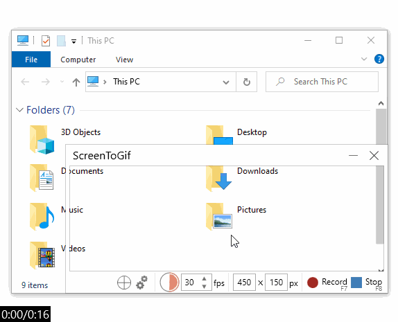
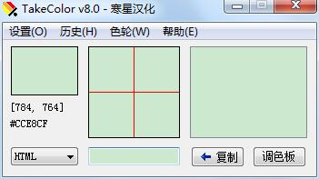

## pc 软件工具集合

### snipaste: 一个简单但强大的贴图工具
  非常强大的截图软件，贴图才是本体！并且还支持取色器、历史记录等功能。
  

### PxCook: 高效易用的自动标注工具,
  是一款标注工具，方便开发和设计协作。能够直接查看对应的 css 样式代码！
  

### Cmber: Windows环境下非常简洁美观易用的cmd替代者

Cmder是一款Windows环境下非常简洁美观易用的cmd替代者，它支持了大部分的Linux命令。


### listory: 一个革命性的Windows搜索工具

Listary 是一个革命性的Windows搜索工具，借助 Listary软件，你可以快速搜索电脑文件、定位文件、执行智能命令、记录访问历史、快速切换目录、收藏常用项目等。


### screenToGif: 一款方便可靠的gif动画录制软件

Screen to Gif是一款方便可靠的gif动画录制软件，可以用来快速录制屏幕上的指定区域，将其直接保存为GIF动画文件




### AutoHotKey: 一款界面简洁功能强大的热键脚本语言

AutoHotkey 是一个自由、开源的宏生成器和自动化软件工具，它让用户能够自动执行重复性任务。一般把其理解为自动化脚本语言，简单说，它可以帮助我完成大量重复性的工作。

Win+S，打开少数派首页——
```
#s::Run https://sspai.com ;win+s 打开少数派网站
```
Win+G，运行 CMD——
```
#g:: ;win+g 运行CMD              
Run Cmd.exe
Return
```

### zeal: 离线文档查看器

zeal是一款为软件开发者设计的离线文档查看器，可以方便管理将近200中软件的文档API，对于离线API查询非常方便


### RegexTester: 正则表达式测试器

RegexTester是一款正则表达式测试器，支持单行模式、多行模式，经典的窗口设计，该工具允许你测试和分析正则表达式。


### TakeColor: 屏幕色彩拾取小工具

takecolor取色器是一款轻便小巧的屏幕色彩拾取小工具。takecolor取色器是目前为止使用感觉比较好的取色工具，可以直接使用快捷键“alt+C”就可以取色，方便快捷

