# 优秀站点

## 学习网站和技术社区

## [Stack Overflow](https://stackoverflow.com/): 技术问答网站

Stack Overflow 作为全球最大的技术问答网站,可以说每个搞过技术的人是必上的网站

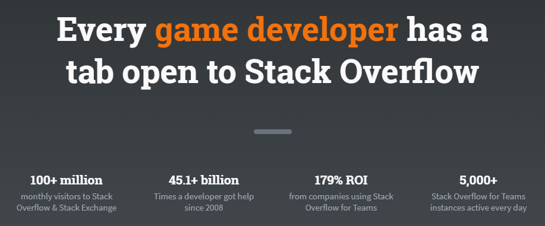

## [奇舞周刊](https://weekly.75team.com/): 前端技术周刊

《奇舞周刊》是一个致力于收集每周前端精华文章、集结成册，每周五推送到微信公众号和知乎专栏的在线杂志，帮助前端设计师们了解前端设计的行业发展和最新的技术，领略前端技术 阅读奇舞周刊。

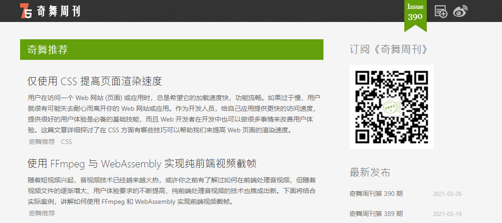

## [掘金](https://juejin.im): 帮助开发者成长的社区

掘金是一个帮助开发者成长的社区，是一个面向互联网技术人的内容分享平台。

## [Medium](https://medium.com/): 国外优质文章网站

Medium 是国外优质文章网站，Medium 的整体结构非常简单，容易让用户沉下心来专注于阅读。上面有很多高质量的技术文章，有很多厉害的人在上面发布内容。

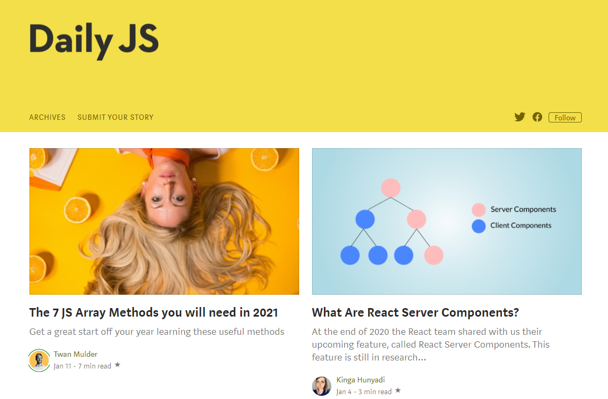

## [B站](https://www.bilibili.com/): Bilibili视频网站

B站现在不仅仅是一个ACG（动画、漫画、游戏）内容创作与分享的视频网站。经过十年多的发展，它构建了一个源源不断产生优质内容的生态系统。现在B站上有许多优质的学习资源等你去发现。

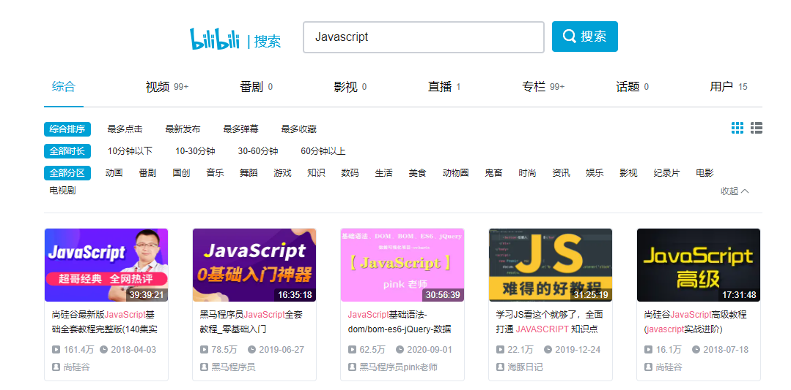

## [CSS Tricks](https://css-tricks.com/): CSS技术网站

CSS Tricks 是一个国外的优秀前端开发网站，主要分享使用CSS样式的技巧、经验和教程等。对于CSSer而言，该网站不断的在更新一些优秀的教程和技巧，为前端社区做出了具大的贡献。

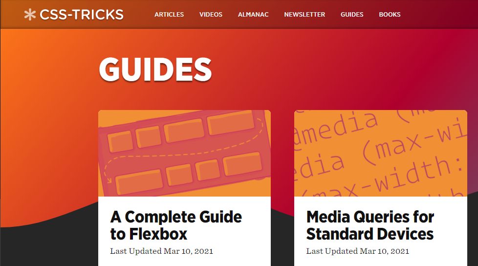

## 工具

### [CodePen](https://codepen.io/) & [codesandbox](https://codesandbox.io/): 代码托管

一个代码托管服务，可以在线写一些小 demo 以及代码分享。

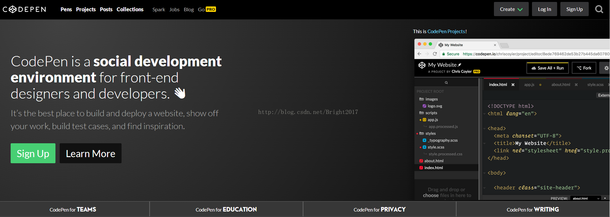

### [Caniuse](https://caniuse.com/): 前端兼容性自查工具

前端兼容性查询工具，支持 html、css、js 等。

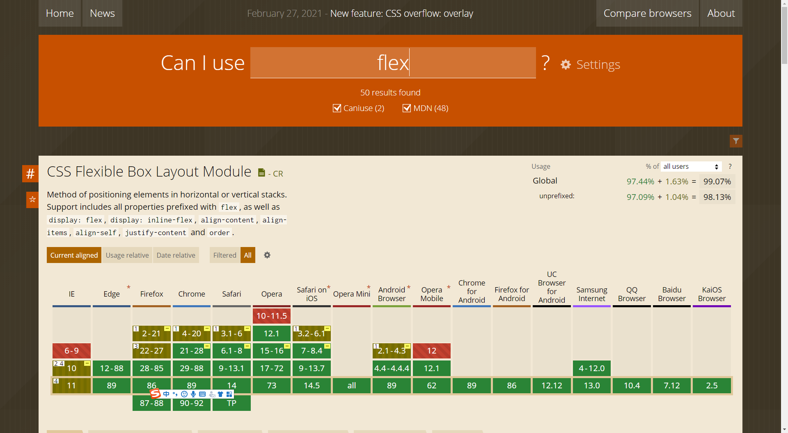

## [Regexper](https://regexper.com/#df*ddf(df)): 图形化正则表达式工具

将正则表达式解释为 railroad 图形化的可视化工具。

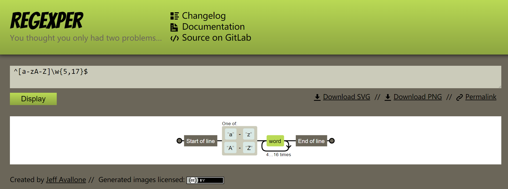

## [Devdocs](https://devdocs.io/): 在线文档网站

DevDocs 集合了多个开发者文档到一个简洁的 Web 界面中，提供即时搜索、离线浏览和移动设备支持，提供黑暗模式，键盘快捷键等等特性。

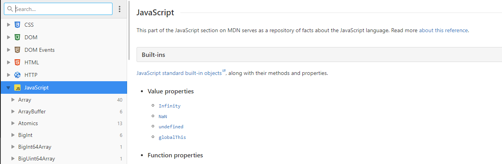

## [CSS Triggers](https://csstriggers.com/): 重绘重排样式查看

CSS Triggers提供在线的页面解析参考, 可通过此参考了解哪些CSS属性触发了重绘和合成, 但不引发布局, 这些是浏览器在渲染网页时的执行过程。

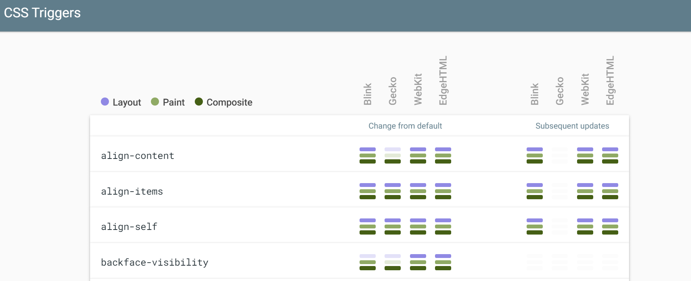

### [Sioe 颜色工具](https://www.sioe.cn/yingyong/yanse-rgb-16/): RGB颜色值与十六进制颜色码转换工具

能够将 RGB 颜色值和十六进制颜色码进行互相转换。

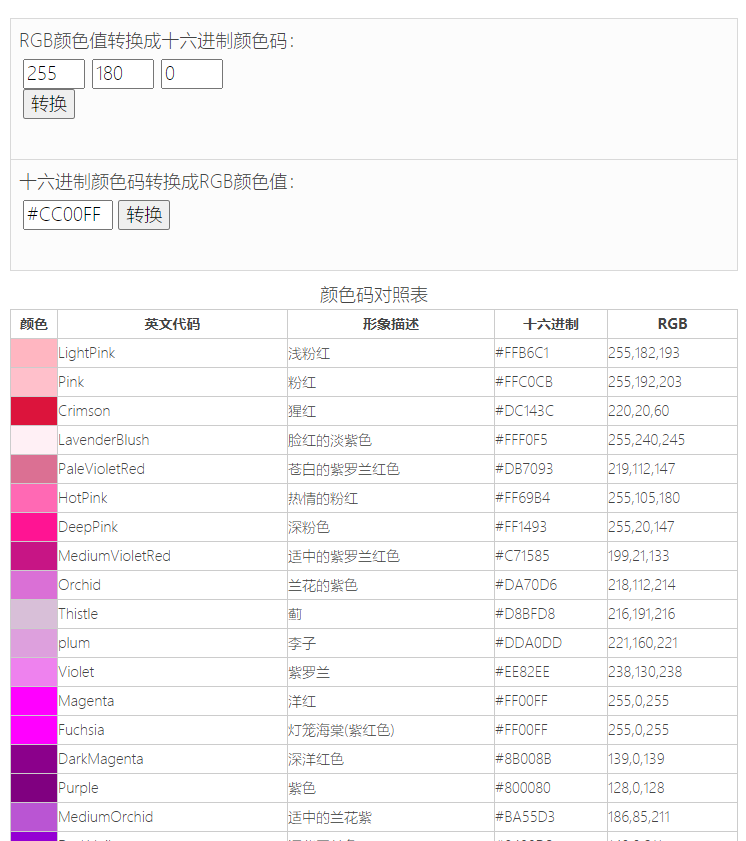

### [站长工具](https://tool.chinaz.com/Tools/unixtime.aspx): 工具集合网站

提供了一些使用工具集合，如 unix 时间戳转换、url 编解码、unicode 编解码等等。

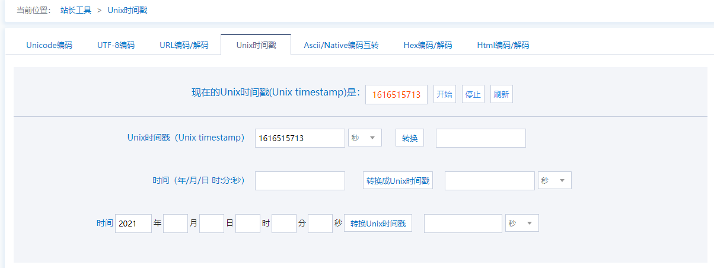