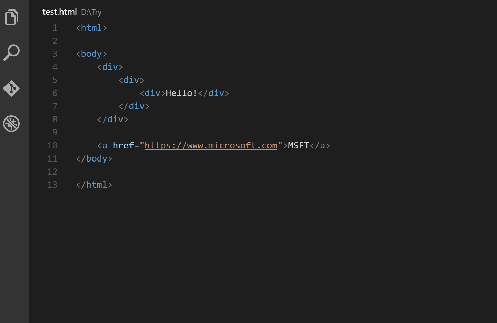
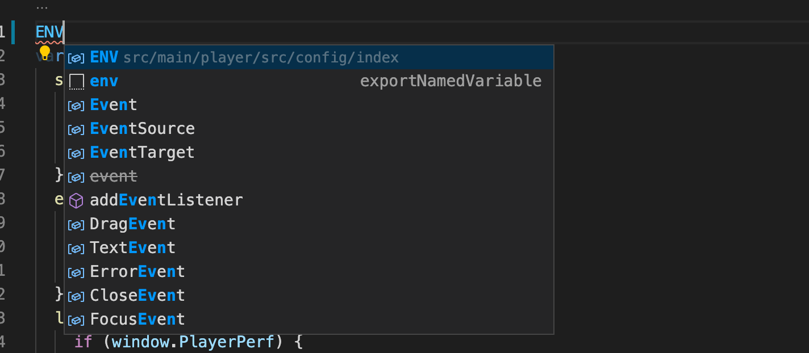
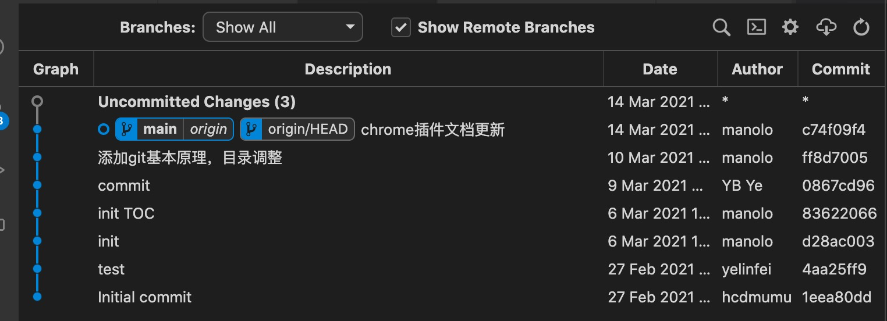
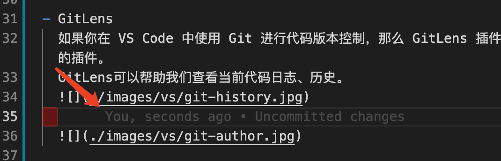
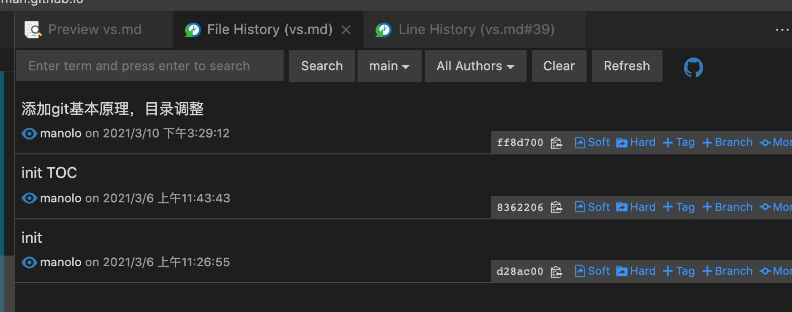
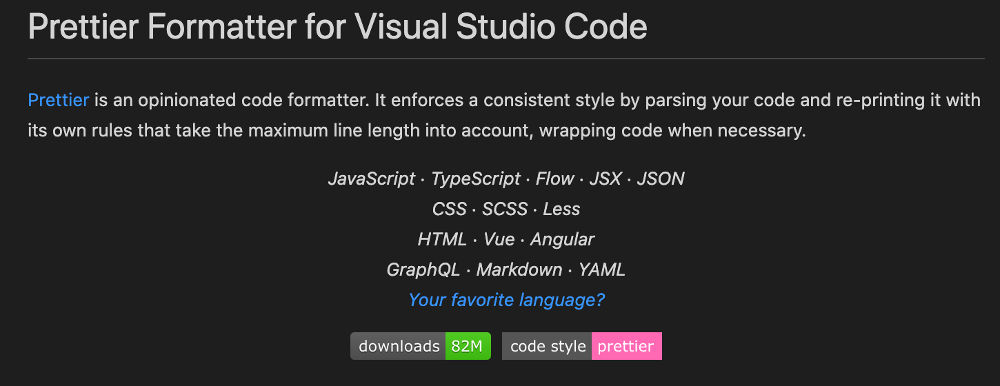
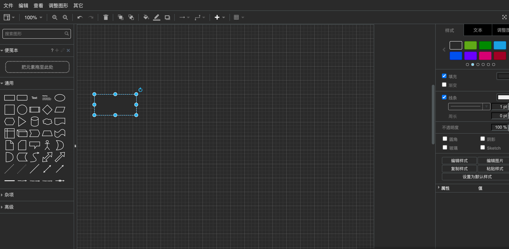

# VSCode 插件

相信大部分的前端开发人员都是在使用 VS Code 在进行开发，VS Code 之所以如此受欢迎，除了本身有微软背书以外，其插件生态所带来的众多的插件也功不可没。

- ESLint
  在多人协同的项目开发中，代码规范是十分重要的，良好的代码规范易于代码阅读，可以让人少犯错误，也能在一定程度上提升代码质量。
  在前端项目开发中，我们需要对 JS 代码进行规范，这个时候就可以使用 ESLint。
  [ESLint](https://eslint.org/) 是一个 JS/TS 代码规范和错误检查工具，它可以帮助你在 VS Code 中编写 JS 或 TS 时，进行语法、规范检查。使用该插件需要在全局或在本地项目中安装 eslint，除此之外，还需要而外配置.eslintrc 配置文件。

  以下是一个基础的 [eslintrc](https://eslint.org/docs/user-guide/configuring/configuration-files) 配置文件

      {
        "env": {
            "browser": true
        },
        "rules": {
            // Override our default settings just for this directory
            "eqeqeq": "warn",
            "strict": "off"
        }
      }

- Auto Rename Tag
  用于自动重命名配对的标签名称，在日常开发中，对于需要闭合的标签。需要手动修改起始标签和结束标签，使用该插件，可以快速进行快速修改。
  

- Auto Import
  通过该插件，可以实现输入变量名、函数名等，自动导入依赖包
  

- GitLens
  如果你在 VS Code 中使用 Git 进行代码版本控制，那么 GitLens 插件一定是必备的插件。
  GitLens 可以帮助我们查看当前代码日志、历史。
  

  

- Git History
  快速浏览 git 仓库文件历史记录，可以快速查看任意文件各版本变更记录。
  

- Prettier (代码格式化工具)
  一款代码格式化工具，支持
  JS/TS 、 Flow 、 JSX 、 JSON、CSS 、 SCSS 、 Less、HTML 、 Vue 、Angular、GraphQL 、 Markdown 、 YAML 等
  

- Draw.io Integration
  可以在vscode中绘制流程图、思维导图、UML，支持导出svg\png\draw.io格式，可在draw.io web端、pc、mac上使用
  

## 其他

- Bookmarks 书签，它可以帮助您导航代码，轻松快速地在重要位置之间移动，不再需要搜索代码。
- Path Autocomplete 导入依赖包，路径自动补全
- open in browser 可以将编辑的 HTML 文件在 VS Code 中用浏览器打开，查看效果
- Reactjs code snippets React.js 的一些代码片段，用于提高开发效率
- Project Manager 多项目管理插件，用于开发中项目快速切换
- Partial Diff 文件差异比对工具，类似于 Beyond Compare，比较两个代码文件差异。
