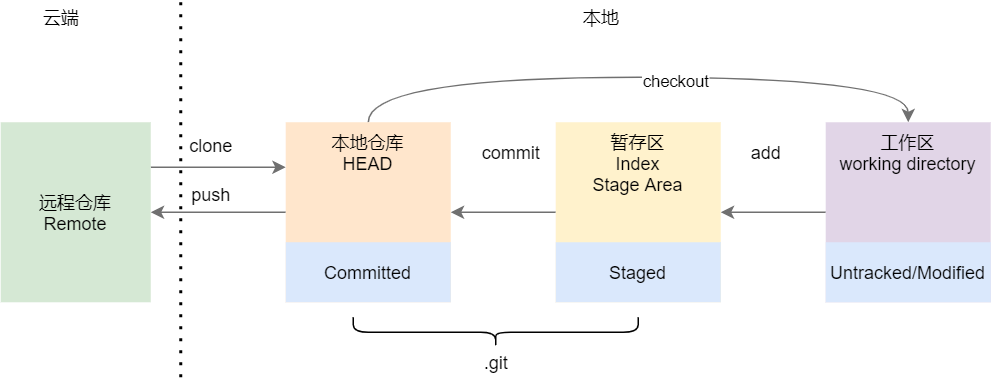
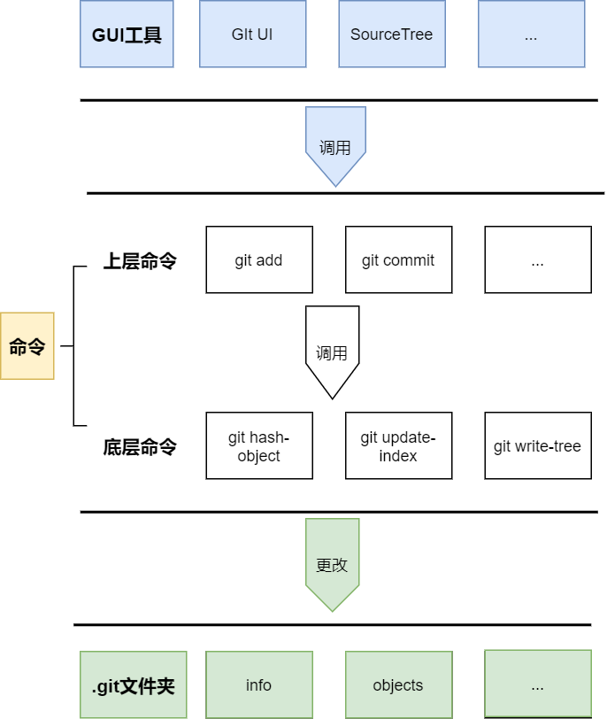

# Git 原理

> Git 不仅是一个分布式版本管理系统（Distributed Version Control System， DVCS），还是一个内容寻址（content-addressable）文件系统，它在内容的存储和管理方式上和其他版本管理系统（如SVN）有很大的差异。要掌握`Git`，最根本的就是要理清，它是如何管理文件的。

## 基本原理

### 记录快照，而非差异
SVN等类似的工具，是基于差异（delta-based）的版本控制系统，存储的是文件各个版本之间的差异内容


Git更像是一个小型的文件管理系统，存储的是文件的快照。每单提交更新时，都会对修改的文件生成一个新的快照。

> 也就是说如果文件没有改变，就不会生成新快照。


### 三个阶段和文件状态
针对文件的暂存(`add`)、提交(`commit`)等操作都会在`.git/objects`下生成相应类型Git对象。这些对象保存了不同阶段的文件信息，同时通过文件状态可以辨别文件所处的阶段。接下来我们看下GIT的三个阶段和文件状态的关系。




* 工作区(Working directory)：当前从某个版本检出的工作区的目录，也就是我们编辑的源文件
    * `untracked(未跟踪)`：新增的文件
    * `modified(已修改)`：修改的文件，但还没保存到数据库中。
* 暂存区(Staging area)：暂存区是一个文件，保存了下次将要提交的文件列表信息
    * `staged(已暂存)`：对新增和修改的文件的当前版本做了标记，使之可以包含在下次提交的中
* Git本地仓库当前分支(Head)
    * `committed(已提交)`：数据已经安全地保存在本地数据库中

## 内部原理

### Git对象
前面说到Git是一个内容寻址文件系统，它的核心部分是一个简单的键值对象数据库（key-value data store）。你可以向 Git 仓库中插入任意类型的内容，它会返回一个唯一的键(SHA-1 哈希值)，通过该键可以在任意时刻再次取回该内容。

上面所说的文件快照最终就是存储在这个对象数据库中(即`.git/objects`目录)。在存储时，它们会被转换成Git对象，然后生产一个唯一SHA-1哈希值。在了解`.git`目录之前，我们先了解这些Git对象
* `数据对象(blob object)`：文件快照内容
* `树对象(tree object)`：用于组织不同文件快照之间的关系，形成一种树形结构，和我们的文件目录结构类似
* `提交对象(commit object)`：记录每次提交时的基本信息，包含提交者信息、提交注释、提交时间和提交的内容(指向的某个树对象)

### .git目录

接下来，我们来看下`.git`文件夹的结构，做一个整体的了解

```
.git
└── hooks/
└── info/
└── logs/
    └── refs/
└── objects/
    ├── pack/
    ├── info/
    └── ...
└── refs
    ├── heads/
        ├── master
        ├── develop
        └── ...
    ├── remotes/
    └── tags/
└── config
└── description
└── HEAD
└── index

```
* `objects`目录存储所有数据内容（`对象数据库`），文件快照和一些操作记录都会以Git对象的方式存储在这。另外，Git为了节省存储对象所占用的磁盘空间，会对Git对象进行压缩和打包，其中
    * `pack`文件夹用于存储打包压缩的对象，而
    * `info`文件夹用于从打包的文件中查找git对象；
* `HEAD`文件指向目前正在使用的代码分支，比如当前分支是`master`，则该文件就会指向`master`
* `index`文件保存暂存区(Staging area)信息。
* `refs`目录存储本地分支、远程分支、标签的最近一次的`commit对象`指针
    * `heads`目录记录了本地每一个分支最近一次commit对象的指针；
    * `remotes`目录存储记录每个分支和远程仓库分支的最后一次的通信指针
* `logs`目录记录了本地仓库和远程仓库的每一个分支的提交记录
* `config`文件包含项目的一些配置信息，例如仓库地址、是否开启大小写铭感等
* `hooks`客户端和服务端钩子函数，利用这些钩子可以做很多的事情，比如提交时的代码检查和提交message检查等。

可以看到，一个仓库的所有信息，都存储于这个`.git`目录下。而`objects`作为基础和核心，提供了最基本的数据存储能力。

### 底层命令
Git本身提供了一系列的底层命令，来进行快照文件的管理，完成Git的底层工作，。底层命令包含`git hash-object`、`git update-index `、`git write-tree`、`git commit-tree`等，这些底层命令的执行直接影响到`.git`文件夹下的内容。如果要了解更多的底层命令的使用，[点击这里](https://git-scm.com/book/zh/v2/Git-%E5%86%85%E9%83%A8%E5%8E%9F%E7%90%86-Git-%E5%AF%B9%E8%B1%A1)

相对于底层子命令的是上层命令，也就是我们平时直接使用的命令，如`checkout`、`branch`、`log`、`merge`等，这些命令通常就是调用的底层命令来实现相应的能力，是对底层命令的二次封装，对用户更为友好且易懂。

除了直接使用上层命令外，还可以使用目前网络上的一些GUI工具来管理git仓库，进一步降低学习成本。它们之间的关系大致如下所示




## 参考资料
* [git book](https://git-scm.com/book/en/v2)