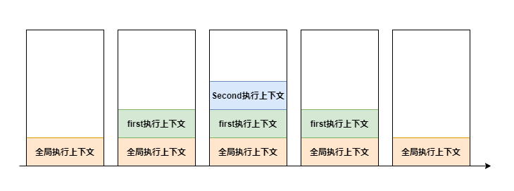

# JavaScript

本文将介绍 JavaScript 的基础知识，帮助你更好的理解 JavaScript，以此避免一些常见的错误。

## 类型

JavaScript 数据类型包括**基本数据类型**和**引用数据类型**

### 基本数据

基本数据类型包括：

- Undefined: 当声明的变量还未被初始化时，变量的默认值为 undefined
- Null: null 用来表示尚未存在的对象，常用来表示函数企图返回一个不存在的对象
- Boolean: 布尔类型
- Number: 数值类型
- String: 字符串类型
- Symbol(ES6): 表示独一无二的值，用于避免属性名的冲突
- BigInt(ES10)：支持的范围更大的整数值

### 引用数据

引用数据类型统称 Object 类型，包括：

- Object：对象
- Array：数组
- Date：日期
- RegExp：正则
- Function：函数
- Set(ES6)：类似于数组，但是成员的值都是唯一的，没有重复的值
- Map(ES6)：它类似于对象，也是键值对的集合，但是“键”的范围不限于字符串，各种类型的值（包括对象）都可以当作键

### 检测数据类型

介绍完数据类型，接下来让我们看下检测数据类型的几种方法

- typeof 主要用于判断基本数据类型
- instanceof 判断引用类型
- constructor 可以检测基本数据类型和引用数据类型，但是 constructor 可能被篡改
- Object.prototype.toString.call() 通用的检测方法

## 作用域

### 什么是作用域

Javascript中的作用域说的是变量的可访问性和可见性。也就是说整个程序中哪些部分可以访问这个变量，或者说这个变量都在哪些地方可见。

### 作用域的类型

Javascript中有三种作用域：

- 全局作用域
- 函数作用域
- 块级作用域

**全局作用域**指任何不在函数中或是大括号中声明的变量，全局作用域下声明的变量可以在程序的任意位置访问

```js
const foo = 'hello' // 全局作用域下定义变量
function print() {
  console.log(foo) // 可以访问到全局变量
}
print()
```

**函数作用域**也叫局部作用域，如果一个变量是在函数内部声明的它就在一个函数作用域下面。局部变量只能在函数内部才能访问到。

```js
function print() {
  const foo = 'hello'
  console.log(foo)
}

greet() // 正常打印 hello
console.log(foo) // 报错：greet is not defined。函数外部无法访问函数内部变量
```

**块级作用域**是在 ES6 中引入的，在大括号中使用``let``和``const``声明的变量存在于块级作用域中。在大括号之外不能访问这些变量

```js
{
  const foo = 'hello'
  var bar = 'world' // 使用 var 在大括号中声明变量为全局变量
  console.log(foo) // 正常打印 hello
}

console.log(bar) // 正常打印 bar
console.log(foo) // 报错：greet is not defined。函数外部无法访问函数内部变量
```

### 词法作用域

JavaScript采用的是词法作用域，所以函数的作用域在函数定义的时候就决定了。

而与词法作用域相对的动态的作用域，函数的作用域在函数调用的时候才决定的。


```js
const value = 1

function foo() {
  console.log(value);
}

function bar() {
  const value = 2
  foo()
}

bar() // 输出1
```

解析下执行过程，首先执行 ``bar`` 函数，``bar`` 函数内部定义变量后执行 ``foo`` 函数，``foo`` 函数执行输出 ``value`` 变量，``foo`` 函数内部没有 ``value`` 变量，故查询外层作用域，找到全局变量 ``value = 1``。为什么是找全局变量，而不是 ``bar`` 函数内部变量呢？

JavaScript采用的是词法作用域，函数的作用域，基于它创建的位置，也就是说函数的作用域在函数定义的时候就决定了。

### 作用域链

作用域链是一个对象列表或者链表，当在 JavaScript 中使用一个变量的时候，首先 JavaScript 引擎会尝试在当前作用域下去寻找该变量，如果没找到，再到它的上层作用域寻找，以此类推直到找到该变量或是已经到了全局作用域。

```js
const value = 1

function foo() {
  console.log(value) // 1
  function bar() {
    const value = 2
    console.log(value) // 2
  }
  
  function qux() {
    console.log(value) // 1
  }
}
```

快速解析下上面的结果：

 ``foo`` 函数没有定义``value``变量，故 JavaScript 沿着作用域链找到了全局变量 ``value``。

``bar``函数定义了``value``变量，故直接输出函数内部定义的``value``值。 

``qux``函数也没有定义``value``变量，故 JavaScript 沿着作用域链找``foo``函数内部是否有变量``value``，结果当然是没有，JavaScript 继续沿着作用域链找到了全局变量 ``value``

## 执行上下文

### 什么是执行上下文

执行上下文是执行 JavaScript 代码的环境的抽象概念。每当 Javascript 代码在运行的时候，它都是在执行上下文中运行。

每个执行上下文中都有四个重要的属性：
- 变量对象(Variable object，VO)
- 活动对象(Activation object, AO)
- 作用域链(Scope chain)
- this

### 执行上下文的类型

- 全局执行上下文 — 这是默认或者说基础的上下文，任何不在函数内部的代码都在全局上下文中。
- 函数执行上下文 — 每当一个函数被调用时, 都会为该函数创建一个新的上下文。
- Eval 函数执行上下文 — 执行在 eval 函数内部的代码也会有它属于自己的执行上下文

### 执行栈

执行栈，也就是在其它编程语言中所说的“调用栈”，是一种拥有 LIFO（后进先出）数据结构的栈，被用来存储代码运行时创建的所有执行上下文。

```js
function first() {
  console.log('Before Second')
  second()
  console.log('After Second')
}

function second() {
  console.log('Second')
}

first()
console.log('End')
```

来看下上面这个例子来理解执行栈



从上图可以清晰看到在运行上述代码的时候整个执行栈的变化情况。

## this

> this对象是在运行时基于函数的执行环境绑定的

简单点来说就是“谁调用的这个函数，this就是谁”。

来看几个例子：

```js
var x = 1
function foo() {
  console.log(this.x)
}
foo()  //  1
```

这个例子中``this``值向``window``，故输出的值为1

```js
var person = {
  name: 'xiaoming',
  showName () {
    console.log(this.name)
  } 
}
person.showName() // xiaoming
```

``this``值指向调用者，故``this === person``，``person.name`` 就是输出值

通过``call``, ``apply``, ``bind`` 可以改变``this``值的指向

```js
var obj = {
  name: 'xiaoming'
}

function foo() {
 console.log(this.name)
}

foo.call(obj)   // xiaoming
foo.apply(obj)  // xiaoming

const bar = foo.bind(person)
bar() // xiaoming
```

``call``和``apply``不同点是传参不一样，``call``的后续参数会传递给调用函数作为参数，而``apply``的第二个参数为一个数组，数组里的元素就是调用函数的参数。

``bind``是会返回一个函数，这个函数中的``this``会被绑定成第一个参数，而且后面重新``bind``是没有效果的。

最后讲箭头函数，箭头函数的``this``就是外层函数的``this``

```js
const name = 'outer'
var person = {
  name: 'xiaoming',
  showName: () => {
    console.log(this.name)
  }
}
person.showName() // outer
```

可以看到箭头函数的``this``是指向外层函数``this``，这边就是 ``window``

## 原型

## 闭包

## 常用函数

- throttle 节流函数
- debounce 去抖函数