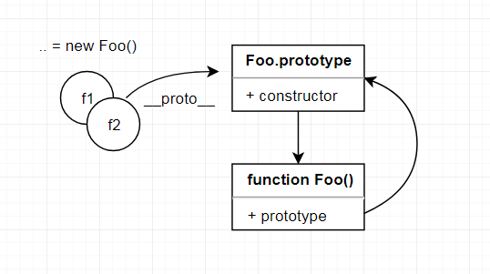

# JavaScript

本文将介绍 JavaScript 的基础知识，帮助你更好的理解 JavaScript，以此避免一些常见的错误。

## 类型

JavaScript 数据类型包括**基本数据类型**和**引用数据类型**

### 基本数据

基本数据类型包括：

- Undefined: 当声明的变量还未被初始化时，变量的默认值为 undefined
- Null: null 用来表示尚未存在的对象，常用来表示函数企图返回一个不存在的对象
- Boolean: 布尔类型
- Number: 数值类型
- String: 字符串类型
- Symbol(ES6): 表示独一无二的值，用于避免属性名的冲突
- BigInt(ES10)：支持的范围更大的整数值

### 引用数据

引用数据类型统称 Object 类型，包括：

- Object：对象
- Array：数组
- Date：日期
- RegExp：正则
- Function：函数
- Set(ES6)：类似于数组，但是成员的值都是唯一的，没有重复的值
- Map(ES6)：它类似于对象，也是键值对的集合，但是“键”的范围不限于字符串，各种类型的值（包括对象）都可以当作键

### 检测数据类型

介绍完数据类型，接下来让我们看下检测数据类型的几种方法

- typeof 主要用于判断基本数据类型
- instanceof 判断引用类型
- constructor 可以检测基本数据类型和引用数据类型，但是 constructor 可能被篡改
- Object.prototype.toString.call() 通用的检测方法

## 作用域

### 什么是作用域

Javascript中的作用域说的是变量的可访问性和可见性。也就是说整个程序中哪些部分可以访问这个变量，或者说这个变量都在哪些地方可见。

### 作用域的类型

Javascript中有三种作用域：

- 全局作用域
- 函数作用域
- 块级作用域

**全局作用域**指任何不在函数中或是大括号中声明的变量，全局作用域下声明的变量可以在程序的任意位置访问

```js
const foo = 'hello' // 全局作用域下定义变量
function print() {
  console.log(foo) // 可以访问到全局变量
}
print()
```

**函数作用域**也叫局部作用域，如果一个变量是在函数内部声明的它就在一个函数作用域下面。局部变量只能在函数内部才能访问到。

```js
function print() {
  const foo = 'hello'
  console.log(foo)
}

greet() // 正常打印 hello
console.log(foo) // 报错：greet is not defined。函数外部无法访问函数内部变量
```

**块级作用域**是在 ES6 中引入的，在大括号中使用``let``和``const``声明的变量存在于块级作用域中。在大括号之外不能访问这些变量

```js
{
  const foo = 'hello'
  var bar = 'world' // 使用 var 在大括号中声明变量为全局变量
  console.log(foo) // 正常打印 hello
}

console.log(bar) // 正常打印 bar
console.log(foo) // 报错：greet is not defined。函数外部无法访问函数内部变量
```

### 词法作用域

JavaScript采用的是词法作用域，所以函数的作用域在函数定义的时候就决定了。

而与词法作用域相对的动态的作用域，函数的作用域在函数调用的时候才决定的。


```js
const value = 1

function foo() {
  console.log(value);
}

function bar() {
  const value = 2
  foo()
}

bar() // 输出1
```

解析下执行过程，首先执行 ``bar`` 函数，``bar`` 函数内部定义变量后执行 ``foo`` 函数，``foo`` 函数执行输出 ``value`` 变量，``foo`` 函数内部没有 ``value`` 变量，故查询外层作用域，找到全局变量 ``value = 1``。为什么是找全局变量，而不是 ``bar`` 函数内部变量呢？

JavaScript采用的是词法作用域，函数的作用域，基于它创建的位置，也就是说函数的作用域在函数定义的时候就决定了。

### 作用域链

作用域链是一个对象列表或者链表，当在 JavaScript 中使用一个变量的时候，首先 JavaScript 引擎会尝试在当前作用域下去寻找该变量，如果没找到，再到它的上层作用域寻找，以此类推直到找到该变量或是已经到了全局作用域。

```js
const value = 1

function foo() {
  console.log(value) // 1
  function bar() {
    const value = 2
    console.log(value) // 2
  }
  
  function qux() {
    console.log(value) // 1
  }
}
```

快速解析下上面的结果：

 ``foo`` 函数没有定义``value``变量，故 JavaScript 沿着作用域链找到了全局变量 ``value``。

``bar``函数定义了``value``变量，故直接输出函数内部定义的``value``值。 

``qux``函数也没有定义``value``变量，故 JavaScript 沿着作用域链找``foo``函数内部是否有变量``value``，结果当然是没有，JavaScript 继续沿着作用域链找到了全局变量 ``value``

## 执行上下文

### 什么是执行上下文

执行上下文是执行 JavaScript 代码的环境的抽象概念。每当 Javascript 代码在运行的时候，它都是在执行上下文中运行。

每个执行上下文中都有四个重要的属性：
- 变量对象(Variable object，VO)
- 活动对象(Activation object, AO)
- 作用域链(Scope chain)
- this

### 执行上下文的类型

- 全局执行上下文 — 这是默认或者说基础的上下文，任何不在函数内部的代码都在全局上下文中。
- 函数执行上下文 — 每当一个函数被调用时, 都会为该函数创建一个新的上下文。
- Eval 函数执行上下文 — 执行在 eval 函数内部的代码也会有它属于自己的执行上下文

### 执行栈

执行栈，也就是在其它编程语言中所说的“调用栈”，是一种拥有 LIFO（后进先出）数据结构的栈，被用来存储代码运行时创建的所有执行上下文。

```js
function first() {
  console.log('Before Second')
  second()
  console.log('After Second')
}

function second() {
  console.log('Second')
}

first()
console.log('End')
```

来看下上面这个例子来理解执行栈


从上图可以清晰看到在运行上述代码的时候整个执行栈的变化情况。

## this

> this对象是在运行时基于函数的执行环境绑定的

简单点来说就是“谁调用的这个函数，this就是谁”。

来看几个例子：

```js
var x = 1
function foo() {
  console.log(this.x)
}
foo()  //  1
```

这个例子中``this``值向``window``，故输出的值为1

```js
var person = {
  name: 'xiaoming',
  showName () {
    console.log(this.name)
  } 
}
person.showName() // xiaoming
```

``this``值指向调用者，故``this === person``，``person.name`` 就是输出值

通过``call``, ``apply``, ``bind`` 可以改变``this``值的指向

```js
var obj = {
  name: 'xiaoming'
}

function foo() {
 console.log(this.name)
}

foo.call(obj)   // xiaoming
foo.apply(obj)  // xiaoming

const bar = foo.bind(person)
bar() // xiaoming
```

``call``和``apply``不同点是传参不一样，``call``的后续参数会传递给调用函数作为参数，而``apply``的第二个参数为一个数组，数组里的元素就是调用函数的参数。

``bind``是会返回一个函数，这个函数中的``this``会被绑定成第一个参数，而且后面重新``bind``是没有效果的。

最后讲箭头函数，箭头函数的``this``就是外层函数的``this``

```js
const name = 'outer'
var person = {
  name: 'xiaoming',
  showName: () => {
    console.log(this.name)
  }
}
person.showName() // outer
```

可以看到箭头函数的``this``是指向外层函数``this``，这边就是 ``window``

## 原型

JavaScript中原型这个概念很经常被提起，那么它到底是什么呢，它又有什么用呢?接下来让我们一步一步来理解它。

## 认识原型
### 原型的概念
在JavaScript中，**原型也是一个对象**，通过原型可以实现对象的属性继承，JavaScript的对象中都包含了一个``[[Prototype]]``内部属性，这个属性所对应的就是该对象的原型。

### 原型访问器
``[[Prototype]]``作为对象的内部属性，是不能被直接访问的。不过我们可以通过下面这几种方式来获取到原型。

+ \_\_proto\_\_
+ Object.getPrototypeOf
+ obj.constructor.prototype

那么可能会有人疑惑，平时我们可以通过函数的``prototype``属性来获取对象原型，这个又是怎么回事？好吧，让我们看个例子。

```js
function Foo () {}
const f1 = new Foo()
const f2 = new Foo()
```



从上面的图我们可以看出``f1``和``f2``对象的``__proto__``属性是指向原型对象的``Foo.prototype``。

同时这边也回答了为什么函数的``prototype``可以获取到对象原型，这是因为函数中有``prototype``这个属性，它是指向原型对象的。

原型对象中也有``constructor``属性指向``Foo``这个构造函数。所以可以用第三种方式来获取到对象原型，不过这个方法不可靠，因为属性可以变嘛。

总结下：
> 每个构造函数都有一个原型对象(prototype)，原型对象都包含一个指向构造函数的指针(constructor)，而实例都包含一个指向原型对象的内部指针(proto)。

这边抛出两个问题：
1. 上面说到原型也是一个对象，那么它肯定也有原型的，它的原型又是指向什么呢？
2. ``Foo``函数也是一个对象，它的原型指向哪里呢？

要想回答这两个问题？这边要引入一个概念**原型链**

## 原型链

### 原型链概念
> 原型链作为实现继承的主要方法，其基本思想是利用原型让一个引用类型继承另一个引用类型的属性和方法。

### 实例分析
还是``Foo``函数来举例子吧。
```js
Function Foo () {}
const f1 = new Foo()
const f2 = new Foo()
const o1 = {}
const o2 = {}
```

先来看下上面的第一个问题：


从这个原型链图中可以看出``Foo.prototype``这个对象的原型是``Object.prototype``。这个也应验了所有对象都继承自``Object.prototype``。

这边还可以看到``Object.prototype``原型是指向``null``的。

接下来来看下第二个问题：


从上图可以看到``Foo``函数的原型是指向``Function.prototype``的。

不知道你们有没注意到，``Function``的原型也是指向``Function.prototype``的，还有``Function.prototype``指向``Object.prototype``

同时这边可以看到``Objcet``也是由函数创建的，函数的原型链上又有``Object.prototype``，这边好像有问题，``Objcet``没被创建之前，函数原型链上为什么会有``Object.prototype``？

这边有一种的解释是：
> 先有 Object.prototype（原型链顶端），Function.prototype 继承 Object.prototype 而产生，最后，Function 和 Object 和其它构造函数继承 Function.prototype 而产生。

顺便提下函数其实也有一个``constructor``属性，它是指向``Function``的。

```js
Foo.constructor === Function  // true
Array.constructor === Function // true
Function.constructor === Function // true
Object.constructor === Function // true
```

讲到这里也差不多了，出一些题给大家看看。
```js
function Foo () {}

typeof (Object) // function
typeof (Array) // function

Foo.constructor === Function // true
Function.constructor === Function // true

Object.prototype.constructor === Object // true
({}).__proto__ === Object.prototype // true

Object.__proto__ === Function.prototype // true
Function.__proto__ === Function.prototype // true

Object instanceof Function // true
Function instanceof Object // true

typeof Object.prototype // object
typeof Function.prototype // function
```

## 闭包

> 闭包(closure)是一个函数在创建时允许自身函数访问并操作该自身函数之外的变量时所创建的作用域

闭包产生的原因是 JavaScript 是词法作用域，函数可以沿着作用域链去查找变量。

通过一个例子来理解上面的定义

```js
var add = (function () {
  var counter = 0
  return function () {
    return counter += 1
  }
})()
```

``add``函数是指向函数执行后返回的那个函数，这时``add``函数中并没有``counter``变量，但是它却能正常访问到``counter``，故这里产生了一个闭包。

闭包可以用于创建私有变量，如上述例子中``counter``就是私有变量，外部无法访问到。闭包也可以用于解决没有之前没有块级作用域的问题。

```js
for (var i = 1; i <= 5; i++) {
  setTimeout(function timer() {
    console.log(i)
  }, 1000)
}

for (var i = 1; i <= 5; i++) {
  (function(i){
    setTimeout(function () {
      console.log(i)
    }, 1000)
  })(i)
}
```

第一段代码会输出 5 个 5，第二段代码会正常输出 1-5

第一段代码中为循环执行 5 次 1 秒后打印 ``i``，但是 1 秒后 ``i`` 已经为 5 了，故输出 5 个 5

第二段代码利用立即执行函数产生闭包，每次执行打印读取的是函数参数中的 ``i``，函数参数为 1-5，故正常打印 1-5

在 ES6 后提供了块级作用域，故上面例子也可以这么实现

```js
for (let i = 1; i <= 5; i++) {
  setTimeout(function timer() {
    console.log(i)
  }, 1000)
}
```

## 常用函数

- throttle 节流函数
- debounce 去抖函数
- 数组去重

## 参考资料
+ [深入理解javascript原型和闭包（完结）](https://www.cnblogs.com/wangfupeng1988/p/3977924.html)
+ [从探究Function.__proto__===Function.prototype过程中的一些收获 ](https://github.com/jawil/blog/issues/13)