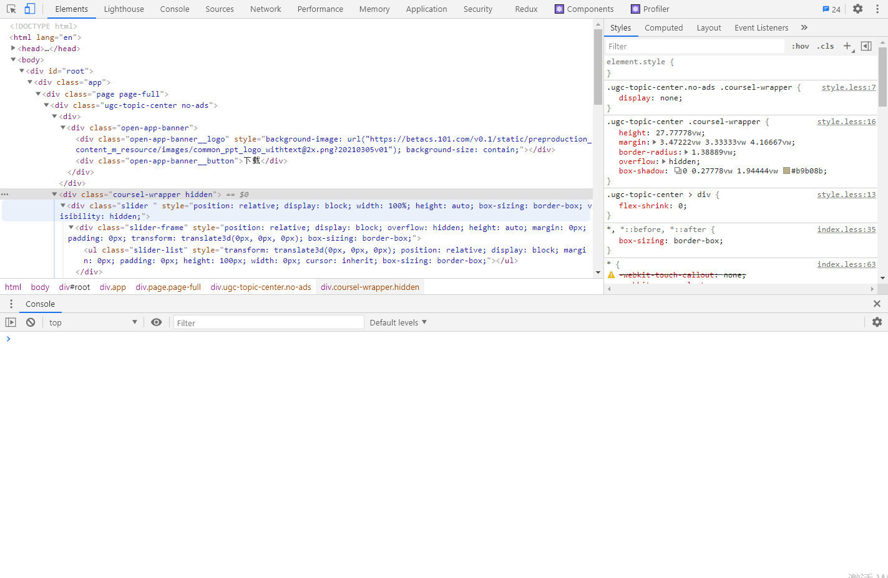
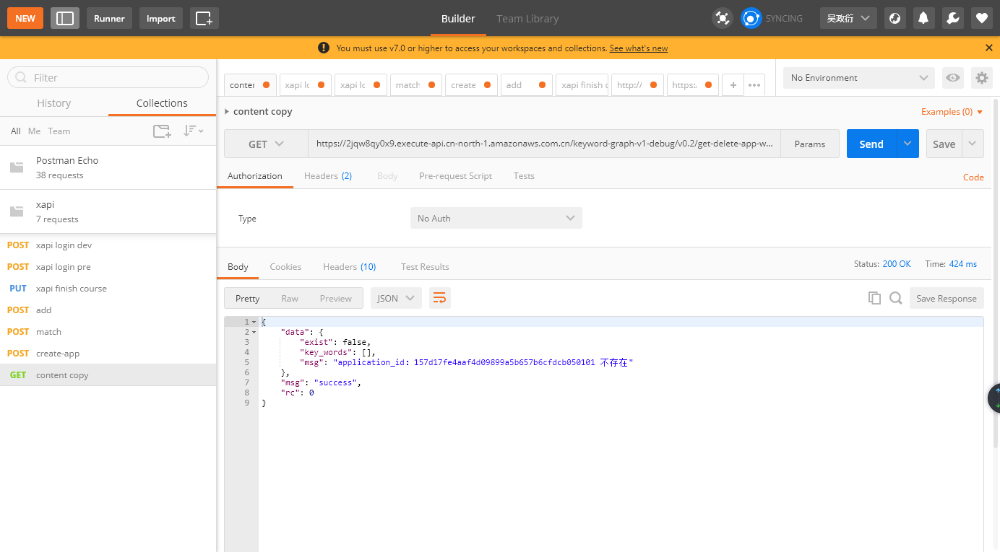
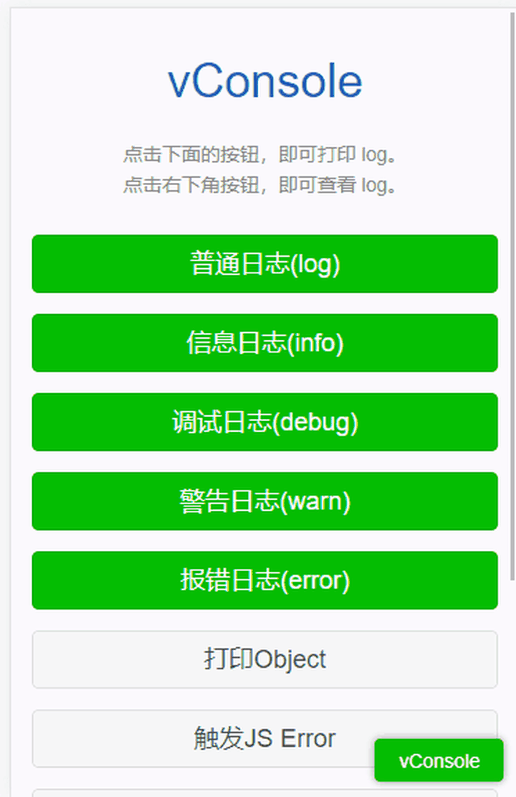
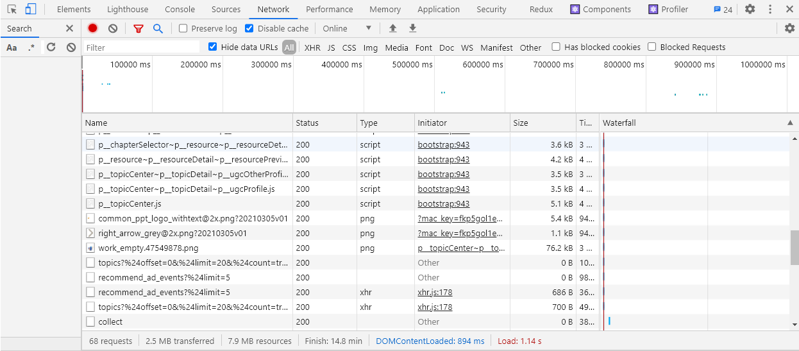
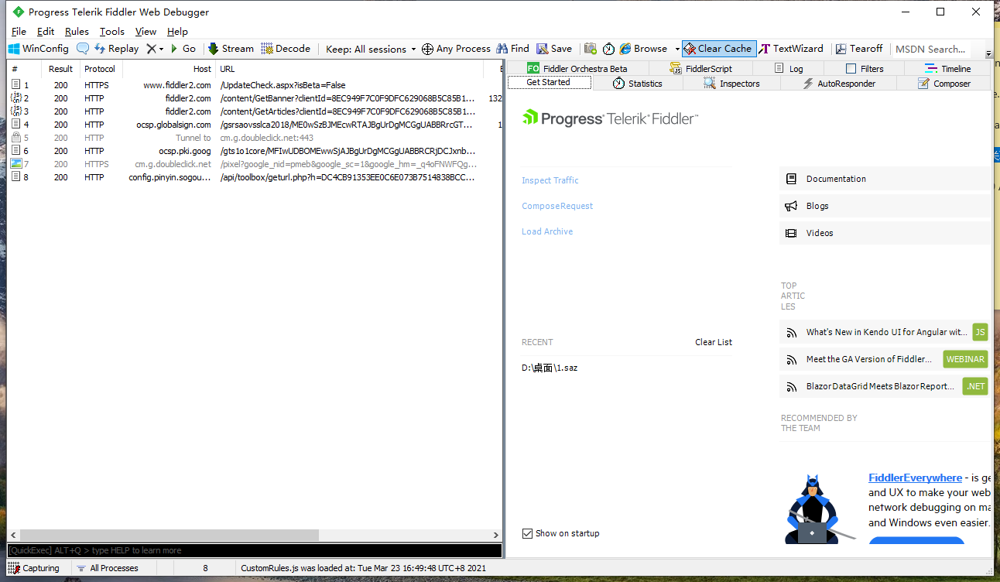

# 工具插件介绍

### VSCODE

- GitLens (git源代码管理插件)
- Prettier (代码格式化工具)
- ESlint (代码检查工具)
- React.js code snippets (代码提示)

### Chrome插件

- Sourcegraph

- 彩云小译
- 二维码生成器
- ReRes (映射管理管理)

### 在线工具

- [Carbon](https://carbon.now.sh/) (分享代码)
- [Can i use](https://caniuse.com/)
- [TinyPNG](https://tinypng.com/)

### 调试工具

#### Chrome Devtools

Chrome 开发者工具是一套内置于Google Chrome中的Web开发和调试工具，可用来对网站进行迭代、调试和分析。

[学习小册](https://juejin.cn/book/6844733783166418958)

#### Postman

HTTP/HTTPS 请求调试

#### VConsole

vConsole 由腾讯一个轻量、可拓展、针对手机网页的前端开发者调试面板，专为手机 web 页面量身设计，帮助开发者更为便捷地进行开发调试工作。

### 网络监控

#### Chrome Devtools Network

### 请求拦截模拟

#### Fiddler

HTTP/HTTPS 调试抓包工具

### 优秀站点

#### Stack Overflow

[Stack Overflow](https://stackoverflow.com/) 作为全球最大的技术问答网站,可以说每个搞过技术的人是必上的网站

#### 奇舞周刊

[《奇舞周刊》](https://weekly.75team.com/)是一个致力于收集每周前端精华文章、集结成册，每周五推送到微信公众号和知乎专栏的在线杂志，帮助前端设计师们了解前端设计的行业发展和最新的技术，领略前端技术 阅读奇舞周刊。

#### 掘金

[掘金](https://juejin.im)帮助开发者成长的技术社区

#### Medium

[Medium](medium.com/) 是国外优质文章网站，Medium 的整体结构非常简单，容易让用户沉下心来专注于阅读。上面有很多高质量的技术文章，有很多厉害的人在上面发布内容。

### 画图工具

#### Visio

Office Visio 是Office软件系列中的负责绘制流程图和示意图的软件，是一款便于IT和商务人员就复杂信息、系统和流程进行可视化处理、分析和交流的软件
#### ProcessOn

ProcessOn 是一个在线作图工具的聚合平台，
它可以在线画流程图、思维导图、UI原型图、UML、网络拓扑图、组织结构图等等
