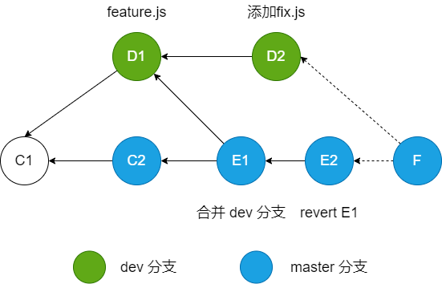
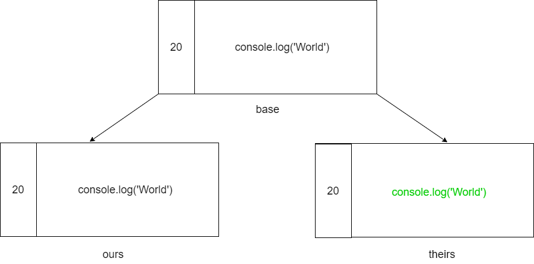

# Git 进阶之 merge/rebase

## 背景
**小菜**：“大鸟我最近碰到一件怪事”

**大鸟**：“哦？说来听听。”

**小菜**：事情是这样的...

**旁白**：
  如下图，小菜从 Master 分支的提交 C1 迁出了一条新分支 Dev，并添加了feature.js，这是一个新功能；
  然后他切换到 Master 分支，发现此时同时有一个新提交 C2，他把自己的 Dev 分支合了过来，然后发布了。

  第二天，QA 提出这个新功能会导致 bug，所以小菜只好先把新功能 revert 了；
  这时，小菜又切换到自己的 Dev 分支，他添加了一个 fix.js 文件，这个文件 import 了 feature.js，这样修复了之前导致的 bug。

  这次小菜长了心眼，他现在本地自测了一下，但是发现在 Master 上合并 Dev 分支后，自己的 feature.js 文件没了！

  

**大鸟**：“我知道了，要解决这个问题，我们得先了解一下分支合并的一些相关知识...”

## 问题
1. 为什么小菜的 feature.js 会丢失？
2. 怎样操作才能正常合并 Dev 分支到 Master？

## 文件合并
- **两路合并（Two-way merge）**


如果采用两路合并算法，则 Git 无法判定要使用哪个版本。可能会有一下几种情况：
1. Ours 版本没有修改，Theirs 版本修改了
2. Ours 版本修改了，Theirs 版本没有修改
3. 两个版本都修改了
3. 两个版本都增加了

所以这种算法并不能帮助我们进行自动合并，那么如果增加信息呢？下面来看三路合并算法。

- **三路合并（Three-way merge）**



对比两路合并算法，三路合并增加了一个 base 版本，这个版本代表上一个版本，即（**最佳公共祖先**）。
我们发现：
* **在只有一个版本的内容发生变化时，三路合并算法是能够自动合并的。**
* 如果两个版本的内容都发生变化，则根据内容是否一致来决定自动合并/抛出冲突。

所以上面的例子最终的结果是采用 Theirs 版本。

## 合并策略
Git 有很多合并策略，常见的有：Recursive、Ours、Theirs、Octopus 等

### **Fast-forward**
Fast-forward 是一个比较简单的合并策略。它的核心内容是：
**在分支合并时，如果发现最佳公共祖先就是它们其中之一，就会直接移动文件指针，不产生新的提交**

### **Recursive**
Recursive 也被称为递归三路合并，是 Git 分支合并中最常用的策略。
核心内容是：**递归寻找最佳公共祖先节点，并以其为 base 节点，进行递归三路合并。**

在最简单的情况下，那么 Git 的提交树应该是这样的：


> 注：以下所有 Git 提交树，都以其节点名称作为文件内容

当我们要合并中间两个提交 A、B 时，会去寻找他们的最佳公共祖先节点，所以就找到了左边的 A 节点；

以它为 base 节点，根据三路合并算法，最后的合并结果为 B。

### **Ours**
Ours 的合并策略比较简单。它的核心内容是：**完全忽略目标分支，保留当前分支的内容**

所以在这种合并策略下，最后的内容和没有合并时的当前分支的内容是一样的。

### **Theirs**
Theirs 和 Ours 类似，只是保留内容的目标变了。它的核心内容是：**完全忽略当前分支的内容，保留目标分支的内容**

所以在这种合并策略下，最后的内容和没有合并时的目标分支的内容是一样的。

### **Octopus**
这个策略的意思是章鱼。顾名思义，这种策略可以用于合并多条分支。不过，如果出现需要手工解决的冲突，操作将执行失败。

## 解答
那么回到我们最开始的例子以及问题

**大鸟**：“小菜，现在知道为什么你的合并操作结果不对了吗？”

**小菜**：
  知道了，根据 Git 默认的 Recursive 策略，在合并 Master 的 E2 节点 和 Dev 分支的 D2 节点时，会先寻找他们的最佳公共祖先，为 D1；

  以 D1 为 base 节点，D2 的变更是：添加了 fix.js，import 了 feature.js；

  而 E2 的变更是：删除了 feature.js（这里 revert 等同与删除）。

  **最终两个文件的变更被自动合并了**，所以导致 fix.js 中无法 import feature.js

**大鸟**：“说得没错，但这只是对错误进行解释，并不是根本原因”

**小菜**：“那根本原因是什么呢？”

**大鸟**：“根本原因就是你在 Dev 分支上开发的时候，内容并不是最新的”

**小菜**：“我知道了！所以我的 Dev 分支应该先拉取 Master 的最新代码，再进行开发；

  这样我在合并的时候就根本不会使用 Recursive 策略，而是根据 Fast-forward 策略合并就好了！”

**大鸟**：“不错不错，孺子可教也...”

---

## 参考
- https://zhuanlan.zhihu.com/p/192972614
- https://marsishandsome.github.io/2019/07/Three_Way_Merge
- [大话设计模式-程杰](https://book.douban.com/subject/2334288//)

## 附：merge 和 rebase 相关参数
### merge

- ```--stat``` 和 ```-n``` 以及 ```--no-stat```

  ```--stat``` 参数会在合并的提交信息后附加文件差异信息（默认就是会附加的，信息如下图）

  

  ```-n```、 ```--no-stat``` 与 ```--stat``` 相反，不附加文件差异信息

- ```--squash``` 和 ```--no-squash```

  ```--squash``` 参数表示会将被合并的分支提交压缩在一起成为一个新节点，并需要重新确认提交信息。

  ```--no-squash``` 则相反。

  > 注: 该操作会改变 author

- ```--commit``` 和 ```--no-commit```

  ```--commit``` 参数表示在合并后会自动进行提交。

  ```--no-commit``` 参数则相反，不进行自动提交。

- ```--e```, ```--edit``` 和 ```--no-edit```

  ```--e```、 ```--edit``` 表示在成功合并前进行合并信息的编辑。

  ```--no-edit``` 则相反，即使用自动合并的信息。

- ```--ff``` 和 ```--no-ff``` 以及 ```--ff-only```

  ```--ff``` 指 fast-forward 模式，使用该模式进行合并时将不会创造一个新的提交节点。

  ```--no-ff``` 则相反，在合并时会创建一个新的提交节点。

  ```--ff-only``` 表示如果合并过程出现冲突， Git 会自动 abort 此次合并。

- ```--s```, ```--strategy``` <strategy>

  用于指定合并的策略，合并策略详见上方正文。

- ```-X```, ```--strategy-option```

  用于指定合并策略的具体参数。

- ```-m```, ```--message``` <message>

  用于指定合并的提交信息（仅在非 fast-forward 模式下可用）

- ```-abort```

  退出合并（一般在出现冲突时使用）。

### rebase

- ```--i```, ```--interactive```

  打开互动模式，以 GUI 的形式让使用者进行操作。

- ```--stat``` 和 ```-n``` 以及 ```--no-stat```

  同上方 merge

- ```--continue```

  表示继续 rebase 流程，通常用于 rebase 处理冲突后。

- ```--skip```

  表示直接跳过当前分支的提交，采用目标分支的提交。

- ```--abort```

  表示放弃 rebase，并将 HEAD 重置为原始分支。

- ```--quit```

  表示放弃 rebase。

  > 和 ```--abort``` 的区别： ```--quit``` 不会重置工作区和索引
