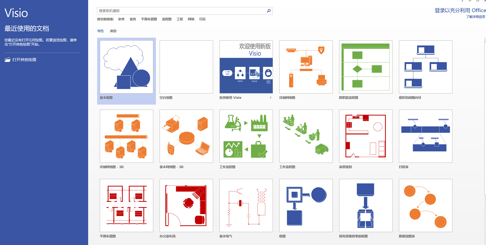

## 调试工具
### 开发者工具
  最常使用的调试工具，功能多样、强大。

  

### [vConsole](https://github.com/Tencent/vConsole) & [eruda](https://github.com/liriliri/eruda)
  移动端调试使用，提供了包括 log、network、element... 等常用调试功能。

  

  

### weinre
  通过注入脚本的方式进行调试，通常在远程调试（webview）时使用。

  

## 请求拦截模拟

### fiddler & charles
  http 协议调试代理工具，能够进行分析抓包、请求的重发、拦截等。

  

  

### postman
  用于模拟请求、接口测试等。

  

## 优秀站点

### [RGB颜色值与十六进制颜色码转换工具](https://www.sioe.cn/yingyong/yanse-rgb-16/)

  能够将 RGB 颜色值和十六进制颜色码进行互相转换。

  

### [站长工具](https://tool.chinaz.com/Tools/unixtime.aspx)

  提供了一些使用工具集合，如 unix 时间戳转换、url 编解码、unicode 编解码等等。

  

### [codepen](https://codepen.io/) & [codesandbox](https://codesandbox.io/)

  一个代码托管服务，可以在线写一些小 demo 以及代码分享。

  

### [caniuse](https://caniuse.com/)

  前端兼容性查询工具，支持 html、css、js 等。

## 画图工具

### visio
  Visio 是微软公司的一款流程图和矢量绘图软件，支持制作流程图、架构图、网络图、日程表、模型图、甘特图和思维导图等，有助于IT和商务专业人员轻松地可视化、分析和交流复杂信息。

  

### drawio
  免费，修改方便、快速，甚至还有对应的 vscode 插件！

  
