## weinre

### 概述
weinre 是一款依赖于 nodejs 的远程调试工具。

### 快速开始

- 安装

  首先我们需要在机器上安装 weinre

  ```cmd
    npm install weinre -g
  ```

- 运行

  * 接着我们需要启动 weinre 服务，运行如下命令

  > 注：这里的 ip、端口可以自行替换，后续所有使用到的也要同步替换

  ```cmd
    weinre --boundHost 192.168.1.8 --httpPort 5000
  ```

  * 然后在浏览器打开 ```192.168.1.8:5000```，就能看到这样的界面：

  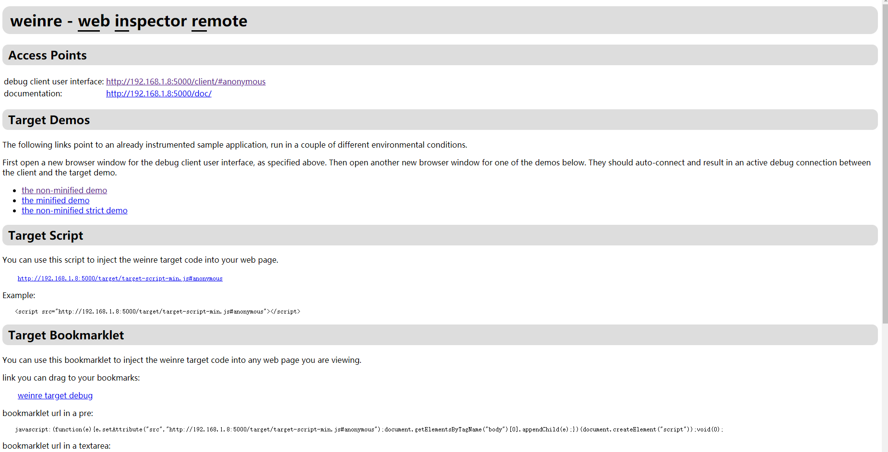

- 注入引用

  接下来需要将 weinre 提供的 script 注入到目标界面中。回到上一步中的 weinre 界面，里面提供了 script 的注入示例。
  我们把它复制下来，粘贴到目标界面。

  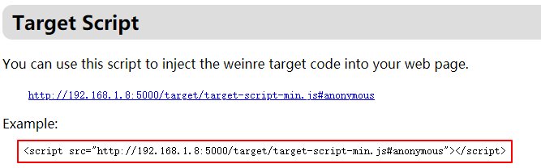
  
- 开始调试

  在我们访问目标界面后，就可以通过这个链接来调试了！

  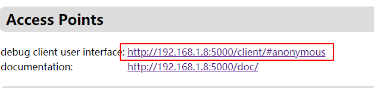

  调试界面如下，有一些常见的调试工具，包括：Elements、Resources、Network、Timeline、Console 等

  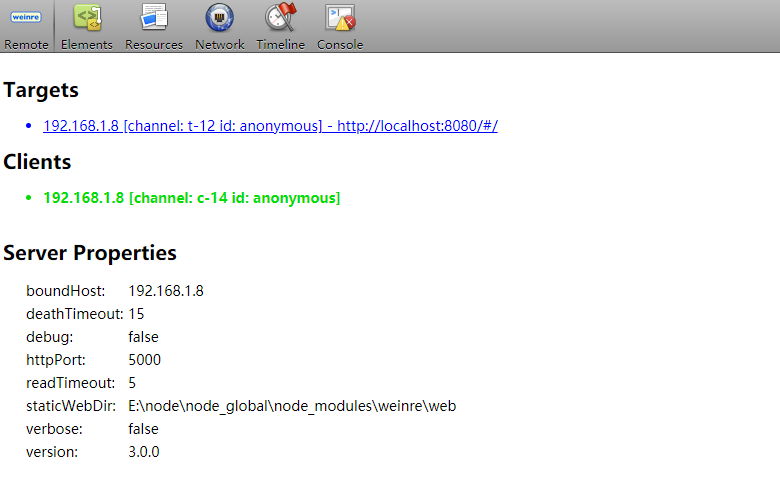

  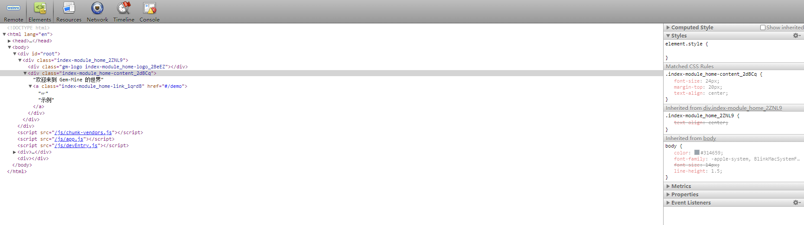

## chii

### 概述
chii 是一款远程调试工具，类似 weinre，不同的是它将 web inspetor 替换成了最新的 chrome devtools frontend

### 快速开始

- 安装

  首先我们需要在机器上安装 chii

  ```cmd
    npm install chii -g
  ```

- 开启服务

  接着启动 chii 服务

  > 注：这里的端口可以自行替换，后续所有使用到的也要同步替换

  ```cmd
    chii start -p 9000
  ```

  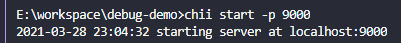

- 注入引用

  然后在目标页面中注入 chii

  ```javasscript
    <script src='//your-ip:9000/target.js'></script>
  ```

- 开始调试

  最后，打开```http://localhost:9000```开始调试，能够使用一些常用的调试工具

    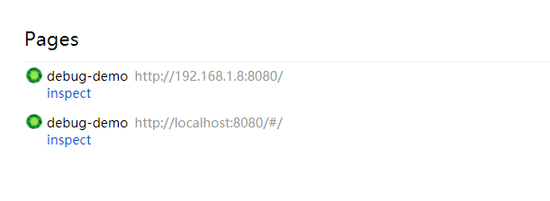

    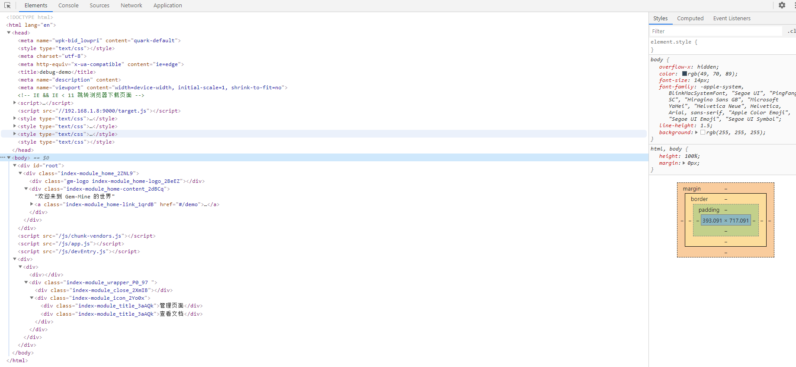

  在设备访问目标页面以及断开时，chii server 的 log

  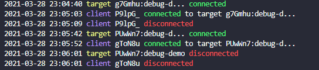

## vConsole & Eruda

### 概述
vConsole 和 eruda 都是为手机网页前端设计的调试面板。

### 快速开始

- 安装

  - 通过下载最新版本或者使用 npm 安装使用

    * [vConsole 最新版本](https://github.com/Tencent/vConsole/releases/latest)

    * [eruda 最新版本](https://github.com/liriliri/eruda/releases/latest)

  ```cmd
    npm install vconsole
    npm install eruda
  ```

- 引用模块

  可以通过在 script/module 中引入并初始化。

  ```html
    <script src="path/to/vconsole.min.js"></script>
    <!-- <script src="path/to/eruda.min.js"></script> -->
    <script>
      var vConsole = new VConsole();
      // eruda.init();
    </script>
  ```

  ```javascript
    var VConsole = require('path/to/vconsole.min.js');
    // var VConsole = require('path/to/eruda.min.js');
    var vConsole = new VConsole();
    // eruda.init();
  ```

- 开始调试

  现在我们就可以开始调试了，可以看到界面上出现了一个按钮，点开即可看到各类常用的调试工具。

  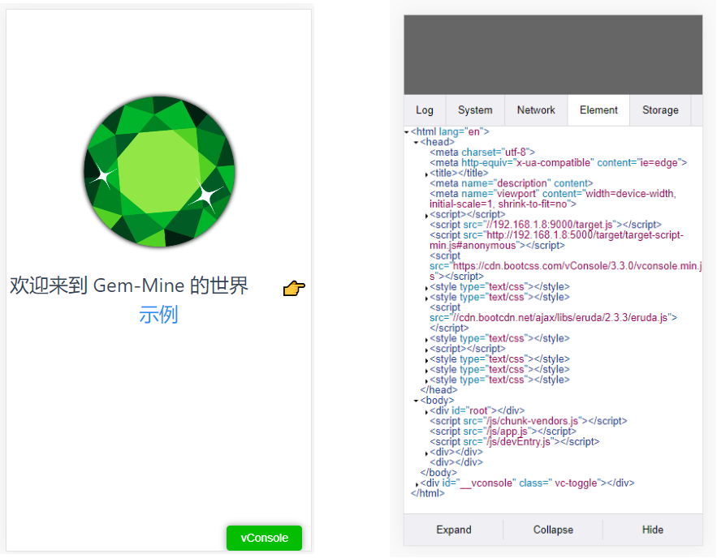

  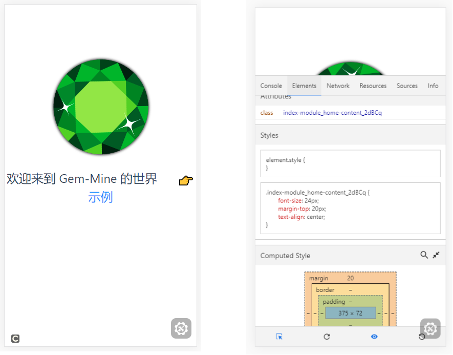
